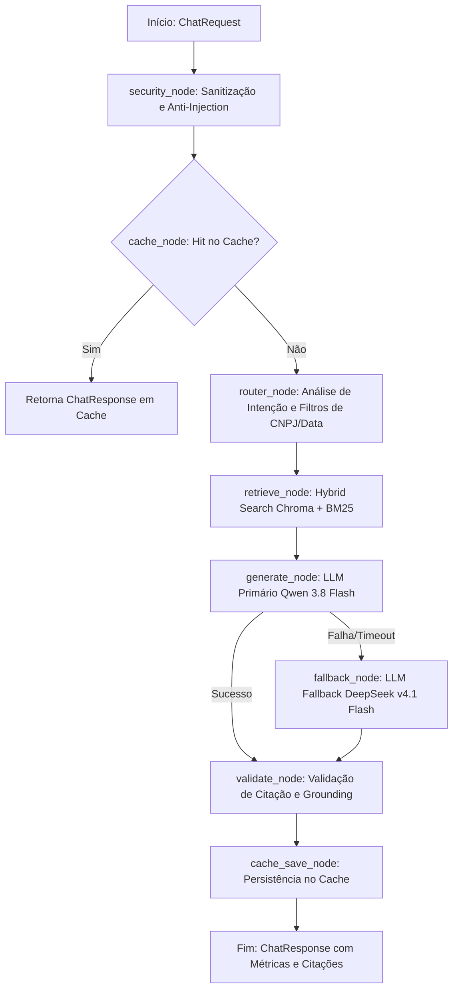

# CONTEXT.md — Sistema RAG de Produção: Andrade Advogados

> **Fonte Única de Verdade (Single Source of Truth) para Agentes de IA e Desenvolvedores.**  
> Este documento define a natureza jurídica, arquitetura de software, restrições operacionais, modelos de dados e guardrails mandatórios do sistema RAG em desenvolvimento para o escritório **Andrade Advogados**.

---

## 1. Visão Geral e Propósito do Projeto

### 1.1. Contexto Institucional
O **Andrade Advogados** é uma instituição jurídica que necessita de um sistema centralizado e altamente confiável para consulta, análise e extração de informações sobre o seu acervo contratual histórico e vigente.

### 1.2. O Objeto do RAG
O sistema é uma API de produção baseada em **Retrieval-Augmented Generation (RAG)** focada primordialmente em:
1. **Contratos de Honorários Advocatícios:** Propostas, contratos de prestação de serviços jurídicos, cláusulas de pró-labore, cláusulas de êxito (*quota litis*), regras de reembolso de custas, condições de rescisão, repactuação... .
2. **Contratos Diversos:** Contratos de prestação de serviços em geral, contratos de parceria, acordos de confidencialidade (NDAs), aditivos contratuais e distratos formalizados entre a Andrade Advogados e seus respectivos clientes (pessoas físicas e jurídicas).

### 1.3. Filosofia de Operação
* **Auditoria e Fidelidade Documental:** O sistema funciona como um assistente de auditoria contratual. A LLM não tem permissão para emitir opiniões jurídicas especulativas ou extrapolar dados que não estejam expressamente pactuados nos documentos.
* **Perímetro Interno Confiável:** Acesso restrito a colaboradores internos autenticados (`internal-collaborator`), com validação rigorosa de cabeçalho `X-API-Key`.

---

## 2. O Nicho Jurídico: Especificidades e Regras Inegociáveis

### 2.1. Sensibilidade de Dados (LGPD e Sigilo Profissional da OAB)
* A base contratual contém dados sensíveis protegidos por sigilo profissional e pela Lei Geral de Proteção de Dados (LGPD):
  * Identificação de clientes: Nomes completos, CPFs, CNPJs, endereços, e-mails e telefones.
  * Dados econômico-financeiros: Valores de honorários, percentuais de êxito, prazos de pagamento, contas bancárias e dados patrimoniais.
* **Diretriz de Sanitização:** O pipeline de entrada ([app/security.py](file:///c:/Users/orugi/Documents/Projetos/production-api-aadvogados/app/security.py)) **não pode ofuscar nem deletar CPFs, CNPJs ou valores**, pois esses dados são chaves essenciais de busca contratual. A limpeza foca na eliminação de *null bytes*, caracteres de controle maliciosos e injeções de prompt.

### 2.2. Vocabulário Contratual e Tipografia Legal
* Documentos jurídicos utilizam caracteres especiais fundamentais para a correta referenciação de cláusulas: `§` (parágrafo), `º` (ordinal masculino), `ª` (ordinal feminino), `art.` (artigo), `cl.` (cláusula) e traços de assinatura (`___`).
* Todos os parsers, sanitizadores e tokenizers devem preservar esses símbolos integralmente.

### 2.3. Padrão Mandatório de Citação (Regra dos 4 Elementos)
Toda resposta gerada pela LLM que envolva contratos deve **obrigatoriamente** fornecer:
1. **Identificador do Contrato:** Nome/título ou número do instrumento (ex.: *Contrato de Honorários nº 104/2023*).
2. **Partes Qualificadas:** Menção explícita do Contratante e Contratada (*Andrade Advogados*).
3. **Localização Exata:** Cláusula, parágrafo ou anexo específico (ex.: *Cláusula 4ª, Parágrafo 2º*).
4. **Transcrição Literal do Trecho-Chave:** O trecho literal do contrato deve ser transcrito (entre aspas ou em bloco de citação) para que o advogado valide a informação sem precisar abrir o documento original.

### 2.4. Política de Abstenção Categórica (Anti-Alucinação Estrita)
* Se a cláusula, valor, data ou condição pesquisada não estiver expressa nos fragmentos recuperados da base, o modelo **é terminantemente proibido de deduzir ou utilizar conhecimento jurídico genérico**.
* **Resposta Padrão de Abstenção:**
  > *"A informação solicitada sobre [assunto/termo] não foi localizada nos contratos disponíveis na base de dados do escritório Andrade Advogados."*

---

## 3. Arquitetura de Dados, Ingestão e Busca Híbrida

### 3.1. Volumetria e Formatos
* **Volumetria Inicial:** Até 500 contratos (~5.000 a 12.500 chunks contratuais).
* **Formatos de Entrada:**
  * Documentos PDF digitais (pesquisáveis).
  * Documentos Microsoft Word (.docx).
  * Documentos digitalizados/scaneados em formato PDF (imagens), demandando motor de OCR integrado sob demanda via loaders nativos do LangChain.

### 3.2. Estratégia de Chunking Jurídico
* É vetada a divisão cega baseada puramente em contagem linear de tokens (evita dissociar condições resolutivas de suas regras gerais).
* **Chunking Semântico Orientado a Cláusulas:**
  * O preâmbulo (qualificação das partes e objeto) forma um chunk inicial de contexto.
  * Cada Cláusula contratual e seus respectivos parágrafos/incisos formam unidades lógicas autônomas.
  * **Header de Contexto em cada Chunk:** Todo chunk recebe no seu cabeçalho: `[Contrato: {nome} | Partes: {partes} | Cláusula: {num}]`.

### 3.3. Mecanismo de Busca Híbrida (Hybrid Search: Dense + BM25)
* **Problema Resolvido:** Modelos de embedding densos falham na busca por CNPJ exato, números de contrato e termos singulares.
* **Solução:** `EnsembleRetriever` do LangChain combinando:
  1. **Dense Retrieval (Semântico):** ChromaDB persistido localmente no disco EBS da EC2 (`./data/chroma`).
  2. **Sparse Retrieval (Léxico Exato):** `BM25Retriever` em memória/cache local, garantindo acerto imediato em consultas por CNPJ (`12.345.678/0001-90`) ou número de contrato.
  3. **Fusão Ponderada:** Fusão com pesos equilibrados (ex.: 50% BM25 + 50% Dense) para garantir que correspondências literais tenham alta prioridade.

### 3.4. Infraestrutura de Hospedagem
* **Hospedagem:** Instância EC2 com **16 GB de RAM**.
* **Soberania dos Dados:** O banco vetorial (Chroma) e o índice léxico (BM25) residem 100% na máquina do escritório, garantindo isolamento total de dados de clientes frente a bancos vetoriais gerenciados em nuvens públicas de terceiros.

---

## 4. Arquitetura do Agente e Orquestração (LangGraph)

### 4.1. Grafo de Estado Determinístico (`StateGraph`)
O processamento de qualquer consulta no [app/agent.py](file:///c:/Users/orugi/Documents/Projetos/production-api-aadvogados/app/agent.py) segue um grafo determinístico:

### 4.2. Modelos de Linguagem Configurados
* **Provedor:** OpenAI-compatible API (definido via `OPENAI_API_KEY` em [app/config.py](file:///c:/Users/orugi/Documents/Projetos/production-api-aadvogados/app/config.py)).
* **Modelo Primário:** `qwen/qwen3.8-flash` (alta velocidade, excelente interpretação de contratos em português).
* **Modelo Fallback:** `deepseek/deepseek-v4.1-flash` (acionamento automático em caso de rate limit, erro HTTP 5xx ou timeout do provedor primário).

### 4.3. Extensibilidade Futura: Busca em Caixas de E-mail
O Grafo de Estado foi desenhado para suportar o acoplamento futuro de um `email_retriever_node` ou `ToolNode` (integrado ao Microsoft 365 / Outlook / Gmail) sem alterar os nós existentes de segurança, cache ou métricas.

---

## 5. Mapeamento da Base de Código

A estrutura do projeto está organizada de forma modular e concisa sob o diretório `app/`:

| Arquivo | Estado Atual | Responsabilidade Arquitetural |
| :--- | :--- | :--- |
| [pyproject.toml](file:///c:/Users/orugi/Documents/Projetos/production-api-aadvogados/pyproject.toml) | Configurado | Dependências do projeto gerenciadas via `uv` (FastAPI, LangChain, LangGraph, LangSmith, SlowAPI, Pytest). |
| [app/config.py](file:///c:/Users/orugi/Documents/Projetos/production-api-aadvogados/app/config.py) | Implementado | Configurações centralizadas via `pydantic-settings` (.env, chaves de API, modelos, TTL de cache, rate limits). |
| [app/models.py](file:///c:/Users/orugi/Documents/Projetos/production-api-aadvogados/app/models.py) | Implementado | Schemas Pydantic para `ChatRequest`, `ChatResponse`, `HealthResponse`, `MetricsResponse` e `ErrorResponse`. |
| [app/security.py](file:///c:/Users/orugi/Documents/Projetos/production-api-aadvogados/app/security.py) | Concluído & Testado | Rate Limiter (`slowapi`), autenticação por `X-API-Key`, sanitizador de entrada (preservando PII legal), filtro de injeção de prompt e pipeline com LangSmith `@traceable`. |
| [app/cache.py](file:///c:/Users/orugi/Documents/Projetos/production-api-aadvogados/app/cache.py) | A Implementar | Cache em memória com controle de TTL (300s) e expiração para perguntas frequentes sobre contratos. |
| [app/agent.py](file:///c:/Users/orugi/Documents/Projetos/production-api-aadvogados/app/agent.py) | A Implementar | Definição do `StateGraph` do LangGraph, integração do `EnsembleRetriever` (Chroma + BM25) e lógica de fallback. |
| [app/monitoring.py](file:///c:/Users/orugi/Documents/Projetos/production-api-aadvogados/app/monitoring.py) | A Implementar | Coleta de métricas em tempo de execução (latência média, tokens consumidos, taxa de acerto de cache, erros). |
| [app/main.py](file:///c:/Users/orugi/Documents/Projetos/production-api-aadvogados/app/main.py) | A Implementar | Ponto de entrada FastAPI: instancia a app, registra middlewares, rotas `/chat`, `/health`, `/metrics` e tratamento global de exceções. |
| [tests/test_security.py](file:///c:/Users/orugi/Documents/Projetos/production-api-aadvogados/tests/test_security.py) | Concluído & Passando | Testes unitários do pipeline de segurança, preservação de CPFs/CNPJs e detecção de ataques em PT/EN. |
| [tests/test_cache.py](file:///c:/Users/orugi/Documents/Projetos/production-api-aadvogados/tests/test_cache.py) | A Implementar | Testes de invalidação por tempo (TTL), hit/miss e controle de concorrência. |
| [tests/test_api.py](file:///c:/Users/orugi/Documents/Projetos/production-api-aadvogados/tests/test_api.py) | A Implementar | Testes de integração end-to-end com `httpx.AsyncClient`. |

---

## 6. Observabilidade e Telemetria (LangSmith)

* **Projeto:** `AndradeAdvogados` configurado em `Settings.langsmith_project`.
* **Trilhas Obrigatórias:**
  * O pipeline de segurança já está decorado com `@traceable(name="SecurityPipeline.run", run_type="chain")`.
  * Os nós do LangGraph devem herdar o tracing automático do LangSmith.
  * O retriever deve registrar os chunks recuperados com seus scores para auditoria jurídica posterior.

---

## 7. Regras de Conduta para Agentes de IA

Ao atuar neste repositório, qualquer agente de IA ou desenvolvedor deve obedecer rigorosamente aos seguintes mandamentos:

1. **Nunca quebre a integridade de dados legais:** Não adicione regexes destrutivas que eliminem pontuação de CPF, CNPJ, símbolos de parágrafo (`§`) ou números de cláusulas no sanitizador.
2. **Mantenha a abordagem de Hybrid Search:** Consultas jurídicas dependem criticamente do casamento exato provido pelo BM25 em conjunto com o Chroma. Não substitua o `EnsembleRetriever` por um retriever puramente denso.
3. **Respeite a política de citação dos 4 elementos:** Qualquer modificação no prompt de sistema ou na geração deve preservar a obrigatoriedade de citar Contrato, Partes, Cláusula e Transcrição Literal.
4. **Disciplina de Testes:** Todo novo módulo implementado (`cache.py`, `agent.py`, `monitoring.py`, `main.py`) deve vir acompanhado de sua respectiva suíte de testes em `tests/`, garantindo 100% de cobertura dos caminhos críticos.
5. **Simplicidade de Infraestrutura:** Mantenha a dependência de serviços externos no mínimo indispensável, honrando a infraestrutura autossuficiente da EC2 de 16 GB.
