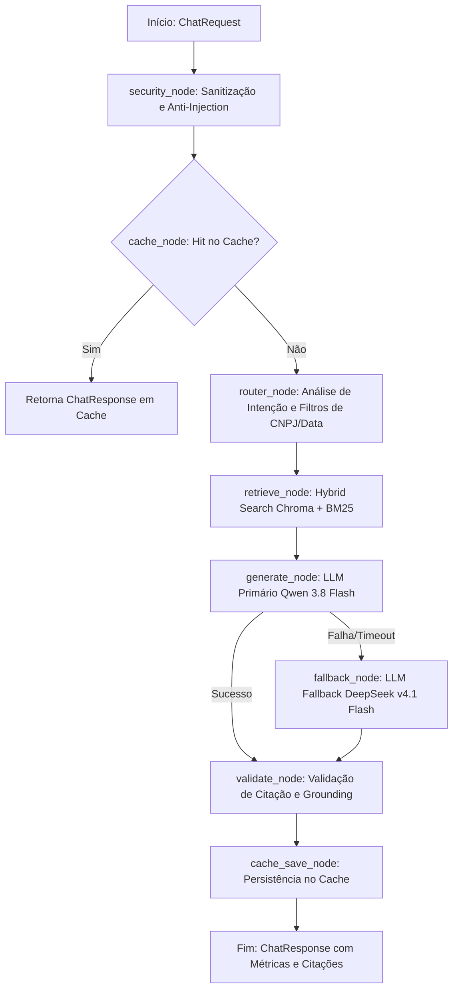

# CONTEXT.md — Sistema RAG de Produção: Andrade Advogados

> **Revisão de prontidão em 05/10/2026:** consultar o [parecer de preparação dos dados](docs/AUDITORIA_PREPARACAO_RAG_2026-10-05.md) antes de executar as Etapas 2–4. As contagens 287/944/61 foram confirmadas, mas a validação humana não está registrada e há lacunas de preservação de QA, cobertura de quase-duplicatas, identidade de indexação e fidelidade do parsing. As afirmações técnicas abaixo sobre garantia de numeração, busca exata e prontidão devem ser lidas com as correções do parecer. As políticas de escopo permanecem vigentes; a revisão não implementou o pipeline nem liberou o corpus para produção.

> **Fonte Única de Verdade (Single Source of Truth) para Agentes de IA e Desenvolvedores.**  
> Este documento define a natureza jurídica, arquitetura de software, restrições operacionais, modelos de dados e guardrails mandatórios do sistema RAG em desenvolvimento para o escritório **Andrade Advogados**.

---

## 1. Visão Geral e Propósito do Projeto

### 1.1. Contexto Institucional
O **Andrade Advogados** é uma instituição jurídica que necessita de um sistema centralizado e altamente confiável para consulta, análise e extração de informações sobre o seu acervo contratual histórico e vigente.

### 1.2. O Objeto do RAG
O sistema é uma API de produção baseada em **Retrieval-Augmented Generation (RAG)** focada primordialmente em:
1. **Contratos de Honorários Advocatícios:** Propostas, contratos de prestação de serviços jurídicos, cláusulas de pró-labore, cláusulas de êxito (*quota litis*), regras de reembolso de custas, condições de rescisão, repactuação... .
2. **Contratos Diversos:** Contratos de prestação de serviços em geral, contratos de parceria, acordos de confidencialidade (NDAs), aditivos contratuais e distratos formalizados entre a Andrade Advogados e seus respectivos clientes (pessoas físicas e jurídicas).
3. **Contratos de Clientes com Terceiros:** Instrumentos redigidos, revisados ou custodiados pelo escritório em nome de seus clientes (ex.: locação, compra e venda de imóvel, prestação de serviços, acordos extrajudiciais), nos quais a Andrade Advogados **não** é parte. Incluídos por decisão de escopo (ver §3.1.2).

### 1.3. Filosofia de Operação
* **Auditoria e Fidelidade Documental:** O sistema funciona como um assistente de auditoria contratual. A LLM não tem permissão para emitir opiniões jurídicas especulativas ou extrapolar dados que não estejam expressamente pactuados nos documentos.
* **Perímetro Interno Confiável:** Acesso restrito a colaboradores internos autenticados (`internal-collaborator`), com validação rigorosa de cabeçalho `X-API-Key`.

---

## 2. O Nicho Jurídico: Especificidades e Regras Inegociáveis

### 2.1. Sensibilidade de Dados (LGPD e Sigilo Profissional da OAB)
* A base contratual contém dados sensíveis protegidos por sigilo profissional e pela Lei Geral de Proteção de Dados (LGPD):
  * Identificação de clientes: Nomes completos, CPFs, CNPJs, endereços, e-mails e telefones.
  * Dados econômico-financeiros: Valores de honorários, percentuais de êxito, prazos de pagamento, contas bancárias e dados patrimoniais.
* **Diretriz de Sanitização:** O pipeline de entrada ([app/security.py](file:///c:/Users/orugi/Documents/Projetos/production-api-aadvogados/app/security.py)) **não pode ofuscar nem deletar CPFs, CNPJs ou valores**, pois esses dados são chaves essenciais de busca contratual. A limpeza foca na eliminação de *null bytes*, caracteres de controle maliciosos e injeções de prompt.

### 2.2. Vocabulário Contratual e Tipografia Legal
* Documentos jurídicos utilizam caracteres especiais fundamentais para a correta referenciação de cláusulas: `§` (parágrafo), `º` (ordinal masculino), `ª` (ordinal feminino), `art.` (artigo), `cl.` (cláusula) e traços de assinatura (`___`).
* Todos os parsers, sanitizadores e tokenizers devem preservar esses símbolos integralmente.

### 2.3. Padrão Mandatório de Citação (Regra dos 4 Elementos)
Toda resposta gerada pela LLM que envolva contratos deve **obrigatoriamente** fornecer:
1. **Identificador do Contrato:** Nome/título ou número do instrumento (ex.: *Contrato de Honorários nº 104/2023*).
2. **Partes Qualificadas:** Menção explícita das partes do instrumento — Contratante e Contratada (*Andrade Advogados*) nos contratos do escritório, ou as partes efetivas (cliente e outra parte) nos contratos de clientes com terceiros. Nunca presumir a Andrade Advogados como parte.
3. **Localização Exata:** Cláusula, parágrafo ou anexo específico (ex.: *Cláusula 4ª, Parágrafo 2º*).
4. **Transcrição Literal do Trecho-Chave:** O trecho literal do contrato deve ser transcrito (entre aspas ou em bloco de citação) para que o advogado valide a informação sem precisar abrir o documento original.

### 2.4. Política de Abstenção Categórica (Anti-Alucinação Estrita)
* Se a cláusula, valor, data ou condição pesquisada não estiver expressa nos fragmentos recuperados da base, o modelo **é terminantemente proibido de deduzir ou utilizar conhecimento jurídico genérico**.
* **Resposta Padrão de Abstenção:**
  > *"A informação solicitada sobre [assunto/termo] não foi localizada nos contratos disponíveis na base de dados do escritório Andrade Advogados."*

---

## 3. Arquitetura de Dados, Ingestão e Busca Híbrida

### 3.1. Volumetria e Formatos
* **Volumetria Extraída (out/2026):** 1.292 documentos (~1,38 GB) — 246 das classes contratuais (226 `.docx`, 18 `.pdf`, 2 `.doc`) + 1.046 da classe genérica "Documento". Após curadoria (§3.1.5), estimam-se ~450 contratos indexados. Teto de projeto: até 500 contratos (~5.000 a 12.500 chunks).
* **Formatos de Entrada:**
  * Documentos Microsoft Word (.docx) — formato predominante (~92%).
  * Documentos Word legados (.doc, Word 97-2003 binário).
  * Documentos PDF digitais (pesquisáveis).
  * Documentos digitalizados/escaneados em PDF (imagens), demandando OCR local.

### 3.1.1. Fonte Documental: M-Files (M4Law)
* **Origem:** vault "Andrade Advogados" (GUID `{CB1EC3E9-CE05-494D-B640-D59F8CA751F2}`) em `https://andrade.cloudvault.m-files.com/REST`, integrado ao ERP LawOffice.
* **Conta de integração:** `rdib@andradeadvogados.com.br` (decisão: mantida como conta oficial da ingestão). O acesso é estritamente de leitura — o código de ingestão não usa nenhum endpoint de escrita do M-Files.
* **Credenciais:** exclusivamente no `.env` (`MFILES_BASE_URL`, `MFILES_VAULT_GUID`, `MFILES_USERNAME`, `MFILES_PASSWORD`), lidas via `Settings` (senha como `SecretStr`). `m-files/acesso.md` e `data/` estão no `.gitignore`. Nunca versionar, logar ou imprimir credenciais.
* **IDs de classes/propriedades variam entre vaults:** as respostas salvas na coleção Postman (`m-files/M-Files.postman_collection.json`) são de um vault de demonstração (ex.: lá "Contrato" = 34; no vault real 34 = "Acordo"). A coleção serve apenas como referência de endpoints. O extrator resolve classes **pelo nome** em tempo de execução — nunca fixe IDs no código.

### 3.1.2. Escopo do Corpus (Decisão)
* **Extraídas** (configuradas em `Settings.mfiles_sync_classes`; o casamento é pelo nome exato da classe, então "Documento" não inclui "Outro documento"):

  | Classe M-Files (ID real) | Docs | Formatos | Natureza |
  | :--- | :--- | :--- | :--- |
  | Contrato (13) | 177 | 157 docx, 18 pdf, 2 doc | Contratual |
  | Contrato (152) | 31 | docx | Contratual |
  | Acordo (34) | 27 | docx | Contratual |
  | Proposta / Orçamento (153) | 9 | docx | Contratual |
  | Acordo Extrajudicial (9) | 2 | docx | Contratual |
  | Documento (0) | 1.046 | 619 doc, 255 pdf, 164 docx, 4 png, 4 xlsx (~1,29 GB) | **Mista** |

* **Classe "Documento" — extrair tudo, filtrar depois (decisão):** a classe genérica é extraída integralmente para `data/raw`, mas **não é indexada integralmente**. Só ~225 títulos têm termos contratuais; o restante (~820) são petições, embargos, procurações, cartas de preposição, PCMSO/PPRA, documentos pessoais (RG), testamentos etc. A seleção do que entra no índice RAG acontece na etapa de parsing/curadoria (§3.1.5), não na extração.
* **Não extraídas:** demais classes do vault (3.623 documentos no total — petições, procurações, defesas, recursos etc.).
* **Metadados disponíveis por documento:** Nome ou título (100%), Cliente (202/246; 27 clientes distintos), Palavras-chave (180/246), Caso (55/246), Área (27/246). Usados no cabeçalho de contexto dos chunks e como filtros do retriever.

### 3.1.3. Extração (M-Files → Disco Local)
* **Comando:** `uv run python -m app.ingestion.sync [--force] [--classes ...]`.
* **Saída:**
  * `data/raw/files/{doc_id}/{file_id}_v{versão}.{ext}` — binário original, sem transformação.
  * `data/raw/manifest.jsonl` — 1 registro por documento: `mfiles_id`, `mfiles_version`, `class_id`, `class_name`, `title`, `last_modified_utc`, `properties` (nome → valor exibido), `files` (caminho, extensão, tamanho, `sha256`), `status` (`ok` | `no_files` | `failed`), `error`, `synced_at`.
* **Sincronização incremental:** só baixa documentos com nova versão no M-Files; remove localmente arquivos de versões antigas e documentos excluídos do vault. O manifest é a fonte única de metadados para os Document Loaders.
* **Soberania:** `data/` contém PII de clientes e nunca sai da máquina nem do repositório local.

### 3.1.4. Parsing por Formato (Decisão — Document Loaders)
Pipeline unificado: tudo converge para texto com a **numeração de cláusulas materializada**, pré-requisito do chunking da §3.2. Todo processamento é local (nada de APIs de parsing em nuvem).

| Formato | Abordagem | Justificativa |
| :--- | :--- | :--- |
| `.doc` | Conversão headless `soffice --headless --convert-to docx` (LibreOffice) → segue o fluxo `.docx`. Cache dos convertidos em `data/converted/`. | Única opção que preserva estrutura e numeração automática do binário MS-DOC. `UnstructuredWordDocumentLoader` e docling também dependem do LibreOffice para `.doc`, sem ganho. antiword/catdoc/textract perdem a numeração e estão descartados. |
| `.docx` | `docx2python` → texto com numeração de listas reconstruída → `Document` do LangChain. | `python-docx`/`Docx2txtLoader` leem apenas `paragraph.text` e **perdem a numeração automática** do Word (que vive em `numbering.xml`), destruindo a identificação de cláusulas. Fallback: parse manual de `numbering.xml`. |
| `.pdf` digital | Extração da camada de texto nativa. | Rápida e fiel ao texto do instrumento. |
| `.pdf` escaneado | OCR local com Tesseract (`por`) **somente** nas páginas sem camada de texto. | OCR em CPU é lento (~2–5 s/página); detectar antes de aplicar. |

* **Rastreabilidade:** cada arquivo processado registra seu status de parsing (`parsed` | `converted` | `ocr` | `failed`) — falhas nunca são silenciadas.
* **Dependências de sistema:** LibreOffice (`libreoffice-writer` na EC2; instalador oficial no Windows dev, `soffice.exe` em `C:\Program Files\LibreOffice\program\`) e Tesseract + pacote de idioma `por`.
* **Validação obrigatória:** antes de processar o corpus inteiro, verificar numa amostra real que a numeração (`1.`, `1.1`, `Cláusula 4ª`, `§ 2º`, incisos) e a tipografia legal (§2.2) sobrevivem ao parsing.
* **Formatos não textuais** (`.png`, `.xlsx`) da classe "Documento" não são indexados; ficam registrados no manifest como fora do escopo de parsing.

### 3.1.5. Curadoria do Índice — Etapa 1 (Decisão e Implementação)
A extração (`data/raw`) é ampla; o índice RAG é restrito. **Toda decisão é `include` | `exclude` | `review`, com categoria e motivo auditável.** Comando: `uv run python -m app.ingestion.curation [--no-model] [--workers 8]`.

**Decisões de escopo do escritório (políticas — o modelo não as contesta):**

| Caso | Decisão |
| :--- | :--- |
| Instrumentos contratuais, aditivos, distratos, acordos, propostas de honorários | Incluir |
| Atos societários (contrato social, alterações, acordo de quotistas, consórcio) — da AA e de clientes, inclusive os de "Docs Representação e Atos Constitutivos" | Incluir |
| Contratos "PADRÃO" de clientes (contrato-tipo usado com terceiros) | Incluir, com `flags.is_standard_form=true` |
| Modelos genéricos ("Modelo – …") | Excluir |
| Minutas específicas, mesmo com partes reais ("Minuta de Acordo", "Versão revisada pela…", "rev 3") | Excluir |
| Famílias de versões do mesmo instrumento | Revisão: o escritório escolhe a versão final (o CSV sugere uma única versão quando há uma marcada como final; sem versão final, não sugere) |
| Peças processuais, pareceres/análises/relatórios, documentos pessoais, administrativos e normativos (procurações, cartas, notificações, regulamentos) | Excluir |
| Convenção/Acordo Coletivo (CCT/ACT) **e seus aditivos** | Excluir, de forma coerente (evita aditivo "órfão" no índice) |
| Títulos ambíguos: "Homologação de Acordo", "Nota promissória", "Proposta" não-honorária | Revisão |
| Pertencer a uma classe contratual do M-Files | **Não basta**: há petições, regulamentos e fichas nessas classes |

**Arquitetura (camadas, em ordem):**
1. **Fatos estruturais** (`app/ingestion/file_format.py`): formato real por *magic bytes* (8 `.doc` são RTF, 4 são WordPerfect), arquivo corrompido, PDF criptografado, **duplicata exata por SHA-256** (canônico: classe contratual > mais recente > menor ID). Definem a **rota de parsing** da Etapa 2 (`docx` | `libreoffice` | `pdf` | `unsupported`).
2. **Regras de domínio versionadas** (`app/ingestion/curation_rules.py`, `RULES_VERSION`): título normalizado (sem acentos, com limites de palavra) > pasta de origem (propriedade "Caminho original" do sistema de arquivos legado). Precedência: modelo/minuta/parecer → *substantivo inicial de instrumento* ("Contrato de Honorários – Ação Judicial…" é contrato) → peça/pessoal/admin → tipos contratuais. Pasta processual do Contencioso vence título contratual ("Acordo cumprido – X vs Y" é peça), com a regra vencida registrada. Regras só de pasta (exceto Contencioso/Opiniões Legais) são **fracas**: só decidem com concordância do Jev.
3. **Segunda opinião calibrada — Jev** (`app/ingestion/jev_classifier.py`): `typesafe/jev-1.13` (versão fixada) via OpenRouter Decisions API (`POST /api/alpha/decisions`, endpoint **alpha**). Pergunta `categoria` (choice) + `modelo` e `minuta` (noul). Cache persistente por hash(modelo+state+perguntas) em `data/curation/jev_cache.jsonl` → reexecuções determinísticas e sem custo. Custo da primeira execução: ~US$ 0,05 para 1.292 documentos.
4. **Combinação**: regra forte decide; Jev discordante com confiança ≥ 0,80 → `review` (exceto regras de política); sem regra, Jev decide só com confiança ≥ 0,98 (limiar calibrado: o Jev atribuiu 0,93 a erros verificados quando vê apenas metadados). **Controle de snapshot:** se a API responder com snapshot diferente do calibrado (`jev_calibrated_snapshot` = `typesafe/jev-1.13-20260917`), a opinião vira consultiva — gera revisão por conflito, mas nunca decide sozinha — e `summary.model_snapshot_drift=true`.
5. **Sinais de risco em includes → `review`:** documento multi-arquivo (todos os arquivos ficam listados em `files`), PDF criptografado, p(minuta) ≥ 0,80, p(modelo) ≥ 0,80 **ou** p(modelo) ≥ 0,70 sem "Cliente" no M-Files (título genérico, sem parte identificável), palavra-chave "modelo/minuta". Contratos "PADRÃO" são isentos (política).
6. **Famílias de versões → `review`:** (a) por marcador no título (`(2)`, "Versão revisada", "rev final", "finalizada"); (b) **por conteúdo**, entre títulos idênticos no mesmo escopo: texto `.docx` quase idêntico (Jaccard de 5-shingles ≥ 0,85) **e** mesmas partes (conjunto de CPF/CNPJ). Texto quase idêntico com CPFs diferentes é o mesmo modelo usado para partes distintas (ex.: 6 promessas de compra e venda com compradores diferentes) e **não** é família. Comparação 100% local (`app/ingestion/near_dup.py`); documentos não-`.docx` ficam com `flags.near_dup_checked=false` para a Etapa 2 completar a verificação sobre o texto parseado.
7. **Overrides humanos** (`data/curation/overrides.csv`): mesmo layout do `review_queue.csv` (preencher `decisao_final`, `categoria_final`, `revisado_por`, `observacao`; `versao` obrigatória). Prevalecem sobre regras e modelo, **exceto** sobre fatos estruturais. Se o documento ganhar nova versão no M-Files, o override fica `stale` e o documento volta para revisão. Erros de preenchimento falham com mensagem contextual (linha, coluna); ids inexistentes no manifest são reportados em `summary.overrides_unknown_ids`. O preenchimento feito diretamente no `review_queue.csv` é preservado entre execuções.

**Saídas (`data/curation/`, ignorado pelo git):** `curation.jsonl` (1 registro por documento, `schema_version`, `doc_key`, byte-idêntico entre execuções), `review_queue.csv` (priorizado; `;` + UTF-8 BOM para Excel pt-BR; células protegidas contra injeção de fórmula), `qa_sample.csv` (amostra estratificada e reprodutível das decisões automáticas, para o escritório estimar a taxa de erro), `summary.json` (gravado **por último** como marcador de commit: totais, concordância regra×modelo por decisão e por categoria, snapshots do modelo, custo, hash do manifest e do `curation.jsonl`). Todas as saídas são gravadas em `.tmp` e substituídas; arquivo aberto no Excel gera erro explícito.

**Contrato com as Etapas 2-4:**
* `load_curated()` — registros `include` com metadados, `files`/`file.parse_route` e `doc_key`. Levanta `CurationStaleError` se manifest, `RULES_VERSION` ou `schema_version` mudaram, se a gravação foi interrompida (hash do `curation.jsonl` ≠ summary) ou se um arquivo incluído mudou em disco (`verify_files=True` é o padrão). Documentos em `review` **nunca** são indexados.
* `index_plan(indexed)` — dado o estado do índice (`{mfiles_id: doc_key}`), devolve `upsert` (novos ou com nova versão/conteúdo), `delete` (indexados que deixaram de ser `include`: exclusão, revisão, override ou remoção do vault) e `unchanged`. É a base da reindexação incremental do Chroma/BM25.
* **Pré-condições de go-live das Etapas 2-4 (processo, aprovadas na revisão adversarial):**
  1. O escritório revisa o `review_queue.csv` (61 itens; os 25 `POSSIBLE_TEMPLATE` de `Consultivo\Contratos` costumam se resolver em lote) e rotula o `qa_sample.csv`; a taxa de erro das decisões automáticas é reportada e `model_auto_threshold` é recalibrado contra o snapshot fixado.
  2. A Etapa 2 completa a detecção de quase-duplicatas sobre o texto parseado para os documentos em `summary.near_dup_unchecked_includes` (96 hoje: rotas `libreoffice` e `pdf`) e detecta modelos pelo conteúdo (campos não preenchidos, placeholders), devolvendo suspeitas à fila de revisão.

**Resultado (out/2026, regras 2026.10.05-3):** 287 include · 944 exclude · 61 review · 49 duplicatas exatas removidas · 20 docs em famílias por marcador + 2 por conteúdo · concordância regra×Jev 97,2% (decisão) / 86,5% (categoria), n=1.233.

**Proteção de dados:** o Jev recebe **apenas** título, classe, pasta de origem relativa e palavras-chave — nunca o conteúdo dos arquivos nem a propriedade "Cliente". A TypeSafe é operadora adicional (via OpenRouter), aceita por decisão do escritório.

**Limitações conhecidas (tratadas na Etapa 2):** a classificação usa só metadados; quase-duplicatas de conteúdo (mesmo contrato em `.docx` e `.rtf`, versões sem marcador no título) só são detectáveis após o parsing; a classe do M-Files enviesa o Jev (petições na classe "Acordo" → "acordo"), por isso o modelo nunca vence uma regra forte sem passar por revisão humana.

### 3.2. Estratégia de Chunking Jurídico
* É vetada a divisão cega baseada puramente em contagem linear de tokens (evita dissociar condições resolutivas de suas regras gerais).
* **Chunking Semântico Orientado a Cláusulas:**
  * O preâmbulo (qualificação das partes e objeto) forma um chunk inicial de contexto.
  * Cada Cláusula contratual e seus respectivos parágrafos/incisos formam unidades lógicas autônomas.
  * **Header de Contexto em cada Chunk:** Todo chunk recebe no seu cabeçalho: `[Contrato: {nome} | Partes: {partes} | Cláusula: {num}]`.

### 3.3. Mecanismo de Busca Híbrida (Hybrid Search: Dense + BM25)
* **Problema Resolvido:** Modelos de embedding densos falham na busca por CNPJ exato, números de contrato e termos singulares.
* **Solução:** `EnsembleRetriever` do LangChain combinando:
  1. **Dense Retrieval (Semântico):** ChromaDB persistido localmente no disco EBS da EC2 (`./data/chroma`).
  2. **Sparse Retrieval (Léxico Exato):** `BM25Retriever` em memória/cache local, garantindo acerto imediato em consultas por CNPJ (`12.345.678/0001-90`) ou número de contrato.
  3. **Fusão Ponderada:** Fusão com pesos equilibrados (ex.: 50% BM25 + 50% Dense) para garantir que correspondências literais tenham alta prioridade.

### 3.4. Infraestrutura de Hospedagem
* **Hospedagem:** Instância EC2 com **16 GB de RAM**.
* **Soberania dos Dados:** O banco vetorial (Chroma) e o índice léxico (BM25) residem 100% na máquina do escritório, garantindo isolamento total de dados de clientes frente a bancos vetoriais gerenciados em nuvens públicas de terceiros.

---

## 4. Arquitetura do Agente e Orquestração (LangGraph)

### 4.1. Grafo de Estado Determinístico (`StateGraph`)
O processamento de qualquer consulta no [app/agent.py](file:///c:/Users/orugi/Documents/Projetos/production-api-aadvogados/app/agent.py) segue um grafo determinístico:

### 4.2. Modelos de Linguagem Configurados
* **Provedor:** OpenAI-compatible API (definido via `OPENAI_API_KEY` em [app/config.py](file:///c:/Users/orugi/Documents/Projetos/production-api-aadvogados/app/config.py)).
* **Modelo Primário:** `qwen/qwen3.8-flash` (alta velocidade, excelente interpretação de contratos em português).
* **Modelo Fallback:** `deepseek/deepseek-v4.1-flash` (acionamento automático em caso de rate limit, erro HTTP 5xx ou timeout do provedor primário).

### 4.3. Extensibilidade Futura: Busca em Caixas de E-mail
O Grafo de Estado foi desenhado para suportar o acoplamento futuro de um `email_retriever_node` ou `ToolNode` (integrado ao Microsoft 365 / Outlook / Gmail) sem alterar os nós existentes de segurança, cache ou métricas.

---

## 5. Mapeamento da Base de Código

A estrutura do projeto está organizada de forma modular e concisa sob o diretório `app/`:

| Arquivo | Estado Atual | Responsabilidade Arquitetural |
| :--- | :--- | :--- |
| [pyproject.toml](file:///c:/Users/orugi/Documents/Projetos/production-api-aadvogados/pyproject.toml) | Configurado | Dependências do projeto gerenciadas via `uv` (FastAPI, LangChain, LangGraph, LangSmith, SlowAPI, Pytest). |
| [app/config.py](file:///c:/Users/orugi/Documents/Projetos/production-api-aadvogados/app/config.py) | Implementado | Configurações centralizadas via `pydantic-settings` (.env, chaves de API, modelos, TTL de cache, rate limits, M-Files, diretório de dados brutos). |
| [app/models.py](file:///c:/Users/orugi/Documents/Projetos/production-api-aadvogados/app/models.py) | Implementado | Schemas Pydantic para `ChatRequest`, `ChatResponse`, `HealthResponse`, `MetricsResponse` e `ErrorResponse`. |
| [app/security.py](file:///c:/Users/orugi/Documents/Projetos/production-api-aadvogados/app/security.py) | Concluído & Testado | Rate Limiter (`slowapi`), autenticação por `X-API-Key`, sanitizador de entrada (preservando PII legal), filtro de injeção de prompt e pipeline com LangSmith `@traceable`. |
| [app/cache.py](file:///c:/Users/orugi/Documents/Projetos/production-api-aadvogados/app/cache.py) | A Implementar | Cache em memória com controle de TTL (300s) e expiração para perguntas frequentes sobre contratos. |
| [app/agent.py](file:///c:/Users/orugi/Documents/Projetos/production-api-aadvogados/app/agent.py) | A Implementar | Definição do `StateGraph` do LangGraph, integração do `EnsembleRetriever` (Chroma + BM25) e lógica de fallback. |
| [app/monitoring.py](file:///c:/Users/orugi/Documents/Projetos/production-api-aadvogados/app/monitoring.py) | A Implementar | Coleta de métricas em tempo de execução (latência média, tokens consumidos, taxa de acerto de cache, erros). |
| [app/main.py](file:///c:/Users/orugi/Documents/Projetos/production-api-aadvogados/app/main.py) | A Implementar | Ponto de entrada FastAPI: instancia a app, registra middlewares, rotas `/chat`, `/health`, `/metrics` e tratamento global de exceções. |
| [app/ingestion/mfiles_client.py](file:///c:/Users/orugi/Documents/Projetos/production-api-aadvogados/app/ingestion/mfiles_client.py) | Concluído & Testado | Cliente REST somente leitura do M-Files: autenticação por token, re-auth em 401/403, retry com backoff, resolução dinâmica de classes, download de arquivos. |
| [app/ingestion/sync.py](file:///c:/Users/orugi/Documents/Projetos/production-api-aadvogados/app/ingestion/sync.py) | Concluído & Testado | Sincronização incremental M-Files → `data/raw` + `manifest.jsonl`. Testes em `tests/test_ingestion.py` (vault simulado via `httpx.MockTransport`). |
| [app/ingestion/file_format.py](file:///c:/Users/orugi/Documents/Projetos/production-api-aadvogados/app/ingestion/file_format.py) | Concluído & Testado | Formato real por magic bytes e rota de parsing da Etapa 2. |
| [app/ingestion/curation_rules.py](file:///c:/Users/orugi/Documents/Projetos/production-api-aadvogados/app/ingestion/curation_rules.py) | Concluído & Testado | Taxonomia, normalização e regras de curadoria versionadas (`RULES_VERSION`). |
| [app/ingestion/near_dup.py](file:///c:/Users/orugi/Documents/Projetos/production-api-aadvogados/app/ingestion/near_dup.py) | Concluído & Testado | Quase-duplicatas locais por conteúdo (.docx) + partes (CPF/CNPJ). |
| [app/ingestion/jev_classifier.py](file:///c:/Users/orugi/Documents/Projetos/production-api-aadvogados/app/ingestion/jev_classifier.py) | Concluído & Testado | Cliente do Jev (OpenRouter Decisions API) com cache, retry e minimização de dados. |
| [app/ingestion/curation.py](file:///c:/Users/orugi/Documents/Projetos/production-api-aadvogados/app/ingestion/curation.py) | Concluído & Testado | Orquestração da curadoria, overrides, saídas e `load_curated()` (interface da Etapa 2). Testes em `tests/test_curation.py`. |
| [tests/test_security.py](file:///c:/Users/orugi/Documents/Projetos/production-api-aadvogados/tests/test_security.py) | Concluído & Passando | Testes unitários do pipeline de segurança, preservação de CPFs/CNPJs e detecção de ataques em PT/EN. |
| [tests/test_cache.py](file:///c:/Users/orugi/Documents/Projetos/production-api-aadvogados/tests/test_cache.py) | A Implementar | Testes de invalidação por tempo (TTL), hit/miss e controle de concorrência. |
| [tests/test_api.py](file:///c:/Users/orugi/Documents/Projetos/production-api-aadvogados/tests/test_api.py) | A Implementar | Testes de integração end-to-end com `httpx.AsyncClient`. |

---

## 6. Observabilidade e Telemetria (LangSmith)

* **Projeto:** `AndradeAdvogados` configurado em `Settings.langsmith_project`.
* **Trilhas Obrigatórias:**
  * O pipeline de segurança já está decorado com `@traceable(name="SecurityPipeline.run", run_type="chain")`.
  * Os nós do LangGraph devem herdar o tracing automático do LangSmith.
  * O retriever deve registrar os chunks recuperados com seus scores para auditoria jurídica posterior.

---

## 7. Regras de Conduta para Agentes de IA

Ao atuar neste repositório, qualquer agente de IA ou desenvolvedor deve obedecer rigorosamente aos seguintes mandamentos:

1. **Nunca quebre a integridade de dados legais:** Não adicione regexes destrutivas que eliminem pontuação de CPF, CNPJ, símbolos de parágrafo (`§`) ou números de cláusulas no sanitizador.
2. **Mantenha a abordagem de Hybrid Search:** Consultas jurídicas dependem criticamente do casamento exato provido pelo BM25 em conjunto com o Chroma. Não substitua o `EnsembleRetriever` por um retriever puramente denso.
3. **Respeite a política de citação dos 4 elementos:** Qualquer modificação no prompt de sistema ou na geração deve preservar a obrigatoriedade de citar Contrato, Partes, Cláusula e Transcrição Literal.
4. **Disciplina de Testes:** Todo novo módulo implementado (`cache.py`, `agent.py`, `monitoring.py`, `main.py`) deve vir acompanhado de sua respectiva suíte de testes em `tests/`, garantindo 100% de cobertura dos caminhos críticos.
5. **Simplicidade de Infraestrutura:** Mantenha a dependência de serviços externos no mínimo indispensável, honrando a infraestrutura autossuficiente da EC2 de 16 GB.
