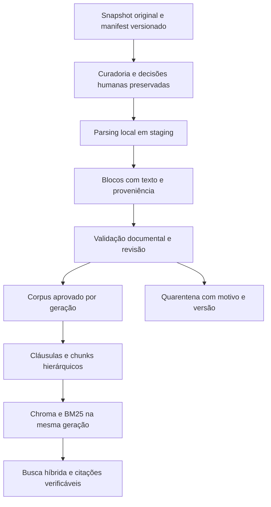

# Parecer de preparação dos dados — RAG Andrade Advogados

Data: 05/10/2026. Base de código inspecionada: `1daa036`. Escopo desta entrega: diagnóstico, desenho revisado e sequência de execução. Nenhum parser, índice ou serviço foi implantado nesta sessão.

## 1. Decisão recomendada

**Manter a arquitetura híbrida Chroma + BM25, mas reabrir o fechamento da curadoria e inserir uma etapa explícita de validação documental entre a classificação e o chunking.** O desenho anterior é um bom ponto de partida, porém não autoriza tratar os 287 incluídos como corpus validado para produção.

É possível preparar um piloto local, isolado e sem publicação, enquanto o escritório revisa as decisões de conteúdo. A escolha de embedding e a resolução de todos os 61 itens não bloqueiam o desenvolvimento desse piloto. Bloqueiam a liberação de seus respectivos dados e, no caso do embedding, a indexação semântica final.

A próxima entrega de engenharia deve ser a preservação das decisões humanas e do snapshot, seguida do contrato de saída do parser e de uma amostra de referência. Só depois vem o parsing experimental. A sequência `parsear 287 → dividir → indexar` omite controles importantes.

As políticas de escopo já documentadas permanecem: instrumentos específicos, atos societários e contratos PADRÃO de clientes podem entrar; modelos genéricos e minutas não entram; as partes reais do instrumento prevalecem, inclusive em contratos com terceiros. Este parecer corrige afirmações técnicas do CONTEXT.md, sem alterar essas decisões de negócio.

## 2. Estado real comprovado

| Item | Evidência verificada | Interpretação |
| --- | --- | --- |
| Acervo bruto | 1.292 IDs únicos, 1.292 arquivos, 1.376.517.686 bytes | Snapshot local existente; não foi verificada disponibilidade atual do M-Files/EC2 |
| Integridade | SHA-256 e tamanhos conferidos em todos os arquivos; sem ausentes ou órfãos | Integridade binária, não qualidade semântica |
| Classificação | 287 include / 944 exclude / 61 review | Contagens do agente anterior confirmadas |
| Origem dos includes | 287 por regras; zero overrides aplicados | Seleção automática, não aprovação humana |
| Revisão humana | Fila: 61 linhas, zero campos humanos preenchidos; overrides.csv ausente | Nenhuma validação humana registrada nesses artefatos |
| Controle de qualidade | 31 exemplos: 15 include e 16 exclude; zero rótulos humanos | Não há estimativa empírica de precisão/recall da curadoria |
| Regras × Jev | 97,24% de concordância de decisão; 86,46% de categoria; n=1.233 | Concordância entre classificadores não equivale a acurácia |
| Duplicatas exatas | 47 grupos de hash; 49 cópias adicionais; nenhum SHA repetido entre includes | Deduplicação física confirmada; política de escolha do canônico tem lacunas |
| Famílias | 20 documentos por marcador + 2 por conteúdo | São contagens de documentos participantes, não de famílias distintas |
| Quase-duplicatas | Apenas 90/287 includes têm near_dup_checked=true | Os 96 reportados omitem outros 101 DOCX sem checagem registrada |
| Rotas dos includes | 191 DOCX; 64 LibreOffice; 32 PDF | As rotas propostas correspondem aos artefatos |
| Formatos legados reais | 58 OLE-DOC, 5 RTF e 1 WordPerfect entre os 64 includes | Extensão .doc não determina o parser |
| Estrutura DOCX | 134/191 com numeração automática direta; 36 com tabelas; 10 com comments.xml | A preservação estrutural é requisito real deste acervo |
| Alterações controladas | 2 DOCX incluídos contêm w:ins e w:del | Evidência de revisões no arquivo; não comprova por si só que são minutas |
| Conteúdo vazio | 1 DOCX incluído sem elementos w:t, sem mídia e sem shingles | Estrutura OOXML válida não garante texto utilizável |
| Parsing/chunking/índices | Não implementados | Ainda não há evidência de fidelidade da extração ou qualidade da busca |
| Aplicação | Cache e monitoramento implementados; grafo LLM parcial; app/main.py vazio | A tabela de implementação no CONTEXT.md está desatualizada |

O campo near_dup_checked=true significa que houve fingerprint no agrupamento atual por título/escopo. Não comprova comparação global nem validação das partes. A nova comparação deve abranger **todos os textos elegíveis parseados**, inclusive os 90 já marcados, e identificar duplicatas entre formatos e títulos diferentes.

Hashes que ancoram este parecer:

- Manifest: `0f5cc6aa55a212e4fbe7fb91d461a1d3f14e42eef5fc91715ad3c7bd64ea7693`.
- Curadoria: `931fd8b8d70023d32dfea6f88f20ae615d3a0fabe1ee68fb06c627c7d1a79dbc`.
- Regras: `2026.10.05-3`; schema: `curation.v1`; snapshot Jev registrado: `typesafe/jev-1.13-20260917`.

Não recalibrar o limiar 0,98 com concordância regra/modelo ou com notas de agentes. A calibração depende de rótulos independentes, separação entre ajuste e avaliação e resultados por estrato. O custo 0,0 no último summary corresponde à execução que reutilizou cache, não comprova o custo histórico total.

## 3. Achados que mudam os próximos passos

### A. Preservação e curadoria

1. **Anotações de QA podem ser perdidas na reexecução.** `app/ingestion/curation.py:585` preserva entradas de review_queue; `:594` recria qa_sample sem seus campos humanos; `:633` substitui os arquivos. Reprodução sintética confirmou apagamento de decisao_final/revisado_por no QA. Também não há histórico permanente para itens que deixam a fila. Antes de solicitar rotulagem, separar um registro durável de avaliações/decisões, ligado a documento, versão, hash, avaliador e data. QA não deve simplesmente “virar overrides”: rótulo de avaliação e decisão operacional têm finalidades distintas; só correções adjudicadas devem alimentar overrides.

2. **Cobertura de quase-duplicatas está subestimada no resumo.** `curation.py:387` ignora grupos de um documento; `:615`–`:617` elimina DOCX da lista de pendências mesmo quando o flag é falso. Há 197 includes sem o flag, não apenas 96. Isso não prova 197 duplicatas: prova ausência de cobertura. CPF/CNPJ citado no texto também pode pertencer a testemunha, representante ou escritório; não deve ser tratado automaticamente como identidade das partes. Ausência de identificador não prova igualdade de partes (`near_dup.py:80`).

3. **Hash/identidade do índice não cobrem todos os determinantes.** `curation.py:242` constrói doc_key apenas com ID, versão e hash truncado do arquivo principal; `:662` verifica somente esse arquivo; `:694` usa doc_key para decidir unchanged. Testes sintéticos confirmaram que alteração de arquivo secundário após override multi-arquivo passa pela validação e que correção de categoria pode manter o índice como unchanged. Todos os documentos atuais são de um arquivo, portanto o caso secundário é uma falha latente, não corrupção observada. A identidade de derivação precisa cobrir todos os arquivos, metadados efetivamente indexados e versões/configurações de transformação.

   O marcador de commit também deve vincular os arquivos de decisões humanas e a configuração efetiva da execução. Hoje `_load_rows()` não detecta que overrides/configuração foram alterados depois da geração. A implementação deve distinguir decisão editada, decisão aplicada e geração publicada, impedindo consumir silenciosamente o estado anterior quando houver uma revogação pendente.

4. **Duplicata física e elegibilidade não são a mesma decisão.** O canônico é escolhido antes das regras (`curation.py:263`, `:268`, `:442`). Uma reprodução sintética exclui uma cópia elegível quando o canônico, escolhido pela classe, é classificado como modelo. No corpus existem cinco cópias com regra favorável apontando a canônicos em review; não foi provada perda real de contrato elegível. Preservar aliases/proveniências e decidir elegibilidade do grupo; a quarentena de um grupo não pode eliminar sua trilha de revisão.

5. **A sincronização atual não é um arquivo histórico imutável.** `sync.py:76` apaga o diretório anterior antes do download; `:154`–`:155` removem IDs ausentes da listagem. `mfiles_client.py:151` apenas avisa sobre MoreResults. Listagem parcial ou execução com subconjunto de classes pode ser interpretada como exclusão; falha no download pode remover o original anterior. É um risco identificado em código; não foi observada perda no snapshot atual. Antes do próximo sync, preservar snapshot recuperável, baixar para staging e só publicar/prunar depois de confirmar completude e escopo da listagem. Exclusão operacional do índice deve usar tombstone e política explícita de retenção local.

### B. Fidelidade do parsing

6. **docx2python é candidato, não garantia de numeração literal.** Seu código oficial declara limitações em formatos como 1.1.1, b) e (ii). A posição da lista não prova o rótulo visível. Resolver OOXML requer document.xml, numbering.xml, estilos, níveis e overrides/reinícios. Manter docx2python na comparação do piloto, sem escolhê-lo como fonte suficiente de citações. Fontes: [numeração do docx2python](https://github.com/ShayHill/docx2python/blob/master/docx2python/numbering_formats.py), [overrides OOXML](https://learn.microsoft.com/en-us/dotnet/api/documentformat.openxml.wordprocessing.leveloverride?view=openxml-3.0.1).

7. **Revisões, comentários e tabelas precisam de política explícita.** Os dois arquivos com inserções/exclusões devem ir para revisão de conteúdo antes da liberação. Não concatenar texto removido e inserido nem aceitar alterações silenciosamente; registrar a visão usada para extração. Comentários não são cláusulas, mas precisam de detecção e avaliação quando indicarem estado de minuta. Tabelas preservam célula, cabeçalho, ordem e vínculo entre valor e condição. Presença de comments.xml não prova comentário substantivo ativo. DOCX deve passar validação de XML/estrutura, além da assinatura ZIP; um ZIP com document.xml inválido é aceito pelo detector atual em caso sintético.

8. **LibreOffice precisa ser validado como conversor.** Fixar versão, fontes, filtro, locale e perfil de usuário por worker; impor timeout e limite de recursos; verificar o derivado, não apenas exit code. Não alterar originais. Conversão pode produzir diferenças de layout; não é prova de equivalência. A documentação confirma parâmetros headless e de conversão, não fidelidade contratual universal. [LibreOffice oficial](https://help.libreoffice.org/latest/en-US/text/shared/guide/start_parameters.html).

9. **Camada de texto presente não dispensa OCR.** PDF misto pode conter só um carimbo pesquisável sobre uma página digitalizada. OCR anterior pode estar defeituoso. Classificar cobertura e qualidade por página/região, comparar com a imagem quando houver dúvida e rotear casos insuficientes para OCR/revisão. Guardar separadamente extração nativa, OCR e escolha de leitura, evitando duplicação do mesmo trecho. OCR sempre gera derivado; o original assinado permanece intacto. [pypdf](https://pypdf.readthedocs.io/en/stable/user/extract-text.html), [OCRmyPDF](https://ocrmypdf.readthedocs.io/en/latest/cookbook.html).

Casos locais para a referência do piloto, identificados sem reproduzir dados contratuais neste parecer:

- ID 5991: DOCX sem texto w:t e sem mídia; deve terminar em revisão/falha explícita, nunca chunk vazio aprovado.
- IDs 5707 e 5829: inserções/exclusões controladas. O primeiro possui 149 inserções e 147 exclusões; a leitura correta exige adjudicação, não concatenação.
- IDs 4582/6734: similaridade Jaccard 0,9884 na heurística atual e mesmo conjunto não vazio de identificadores citados; títulos/escopos diferentes.
- IDs 6818/6821: similaridade 0,867 e ausência de identificadores na mesma heurística.

Os dois pares são **candidatos adicionais**, não duplicatas juridicamente confirmadas. Não foram alteradas suas decisões nesta sessão. A identificação dos riscos deve ser persistida na próxima entrega e sua resolução precede aprovação desses documentos.

### C. Recuperação, geração e governança

10. **BM25 não garante igualdade de CPF/CNPJ.** O pré-processamento padrão é text.split(); diferenças de pontuação podem impedir correspondência. Criar lookup exato em identificadores estruturados, com normalização em campo separado; manter grafia literal para a prova. Normalizar de forma versionada, conforme o tipo, sem presumir que todo identificador seja apenas numérico. O lookup delimita candidatos; BM25 + denso continuam responsáveis pela recuperação de conteúdo. [Código oficial BM25](https://raw.githubusercontent.com/langchain-ai/langchain-community/main/libs/community/langchain_community/retrievers/bm25.py).

11. **Fusão precisa preservar a identidade do contrato.** EnsembleRetriever usa RRF ponderado, não média de scores comparáveis. Configurar id_key=chunk_id, pois o padrão usa page_content e pode fundir cláusulas iguais de contratos diferentes. Peso 50/50 é baseline a medir, não garantia de relevância. [EnsembleRetriever](https://raw.githubusercontent.com/langchain-ai/langchain/master/libs/langchain/langchain_classic/retrievers/ensemble.py).

12. **O agente existente ainda não é RAG.** `app/agent.py:103` envia prompt + mensagens ao LLM; o grafo tem process/fallback/error, sem retrieval nem validação. `:42` presume Andrade Advogados como contratada, contrariando o escopo de contratos de terceiros. `app/models.py:27` não define citações estruturadas. Isso será corrigido na integração, antes de consultas reais ao corpus.

13. **A autenticação não falha de forma segura em produção.** Settings não declara api_secret_key; `security.py:46` consulta atributo opcional, e `:68` retorna internal-collaborator sem chave no fallback. Reproduzido com configuração sintética de produção. Não prova serviço exposto, pois a API está incompleta. É bloqueio de publicação da API, não do piloto local de parsing.

14. **Índices locais não tornam todo o fluxo local.** EC2/EBS são infraestrutura AWS sob controle da organização; Jev recebe metadados e o agente configura API externa. Título, pasta e palavras-chave também podem revelar informações. A decisão já registrada de usar Jev é respeitada; não se presume que ela autorize novos destinos ou envio de contratos completos. LangSmith pode capturar inputs/outputs e metadados quando tracing está ativo. A ativação real e contratos com provedores não foram inspecionados; não há conclusão de vazamento. Manter prova completa local e telemetria externa por lista de campos permitidos, incluindo tratamento de erros e traces filhos. [Controles oficiais LangSmith](https://docs.langchain.com/langsmith/mask-inputs-outputs).

## 4. Arquitetura recomendada para os dados

### Contrato intermediário antes de LangChain Document

JSONL versionado é suficiente para a primeira implementação; um catálogo SQLite local pode organizar relações, identidades e decisões. Chroma e BM25 são derivados reconstruíveis, não a fonte de prova. Exemplo de campos obrigatórios, a formalizar em schema validado:

| Camada | Campos/invariantes |
| --- | --- |
| Origem | source_id com vault/object_type/object_id; versão M-Files; file_id; caminho relativo; SHA-256 completo de cada arquivo; snapshot do manifest |
| Decisão | decisão de escopo, regra/modelo/override, versões, referências às avaliações humanas; decisão de elegibilidade pós-parsing separada da classificação inicial |
| Derivação | parser e versão, configuração, versão do conversor/OCR/fontes relevantes, hashes de entrada/saída; estado parsed/review/failed e códigos de motivo |
| Bloco | block_id, ordem, tipo, texto fiel, rótulo observado/materializado e sua origem; parágrafo/célula/anexo; página/bbox quando disponíveis; flags de incerteza |
| Relações | instrumento, partes com papéis e spans comprobatórios, cláusula pai, remissões, anexo/aditivo/distrato; vínculo confirmado ou pendente |
| Chunk | chunk_id, parent_clause_id, spans de origem, texto de busca separado do texto de citação, tokenizer/limite, política de divisão, cabeçalho derivado |
| Publicação | corpus_generation, conjunto aprovado, hashes dos artefatos, versões de parser/chunker/embedding/tokenização/fusão, escopo de acesso |

Três representações permanecem distintas: binário original; transcrição estruturada fiel; texto normalizado/enriquecido para busca. O cabeçalho `[Contrato | Partes | Cláusula]` não faz parte da transcrição literal. Limpeza para busca não modifica a prova. Instruções encontradas nos documentos são conteúdo não confiável, nunca instruções de execução do agente.

DOCX não possui paginação estável independente da renderização. Citar cláusula/parágrafo/célula; quando houver página, vinculá-la ao hash e à versão de uma rendição. Rótulo ou parte desconhecidos não devem ser inventados. Localizador estrutural não substitui evidência do nome jurídico da cláusula: a resposta pode citar parágrafo/anexo confirmado ou abster-se quando a localização exigida não puder ser estabelecida.

As partes não vêm automaticamente do campo Cliente do M-Files nem de todos os CPFs encontrados. Aditivo não sobrescreve contrato por semelhança textual; registrar vínculo e referência temporal. “Versão final” no título não comprova assinatura ou vigência. Estados assinado/vigente/superado devem permanecer desconhecidos até haver evidência adequada.

### Chunking e recuperação

- Cláusula é unidade lógica; preâmbulo, anexos e tabelas possuem estrutura própria. Preservar condições, exceções, negações e remissões.
- Cláusulas extensas podem ter filhos, divididos por parágrafos/incisos e limitados pelo tokenizer do embedding. Não truncar silenciosamente. Recuperar filhos e expandir contexto do pai/remissões sob orçamento explícito; pai excessivo permanece estruturado, sem exigir carregá-lo inteiro.
- Não adotar “semantic chunking” com LLM/embedding como premissa: para este acervo, a hipótese inicial é segmentação estrutural jurídica com validação. O embedding serve à busca semântica.
- Usar mesmo corpus, filtros e escopo autorizado nas duas buscas. BM25 precisa pré-processamento simétrico de documentos/consultas; lookup exato trata identificadores. Relevância zero também pode retornar top-k; resultado recuperado não é prova de resposta.
- RRF por chunk_id, expansão de contexto, geração estruturada e validação. O servidor resolve título, partes, localização e texto citado a partir de source_id/span; valida que a citação pertence à geração ativa e ao escopo permitido.
- Correspondência literal verifica a citação, mas não garante que a conclusão seja suportada. Avaliar suporte das afirmações, contradições e abstenção separadamente.

### Incrementalidade sem divergência entre índices

Reutilizar o conceito de index_plan, ampliando a assinatura de derivação. Ela inclui conjunto completo de arquivos, metadados usados, decisão efetiva e versões/configurações de parser, normalização, chunker, tokenizer e embedding. Mudança de configuração relevante exige derivação/reindexação mesmo sem nova versão M-Files.

Para o porte atual, preferir construir uma geração completa de índices a partir dos chunks aprovados, reutilizando parsing e embeddings por hash quando válido. Reconstruir BM25 é simples; não simular transação entre duas mutações independentes. Só publicar o ponteiro da geração quando Chroma e BM25 tiverem o mesmo conjunto de chunk_ids. Leitores fixam a geração durante a requisição; falhas preservam a anterior; rollback é explícito. Medir custo antes de evoluir para atualização fina dos dois índices.

Cache de resposta deve incluir geração, escopo de acesso, configuração de recuperação e versão relevante do prompt/modelo. O cache atual baseado só na pergunta (`app/cache.py:24`) não atende esse contrato. Exclusões/revogação de acesso exigem impedir imediatamente o uso da geração/entrada antiga afetada; a política de retenção do original é separada da permissão de consulta.

## 5. Sequência e critérios de avanço

Todas as metas abaixo são **propostas de aceitação**, ainda não resultados obtidos. Aprovação de desenho não substitui os testes de cada etapa. Pontuação de agente não substitui validação documental por responsável do escritório.

| Entrega | Trabalho | Critério para avançar |
| --- | --- | --- |
| 0 — Preservar e corrigir a base | Snapshot recuperável; decisões/QA em registro durável; contagem de cobertura completa; fingerprints/arquivos; grupos de duplicatas; bloqueio de sync parcial | Testes reproduzem e corrigem A1–A5, incluindo arquivo secundário, metadado/categoria indexado e override/configuração após geração; nenhuma alteração silenciosa dos originais; recuperação demonstrada |
| 1 — Definir contrato e referência | Schema de blocos/spans/versões/estados; amostra determinística; referências visuais com revisão humana | Cada caso tem resultado esperado e proveniência; ambiguidade explicitamente em revisão; desenho revisto pelos três agentes com nota individual >=9 e sem bloqueio crítico aberto para a entrega |
| 2 — Piloto de parsing | 30–50 documentos estratificados, todos os formatos raros incluídos; numeração multinível, tabelas, revisões, PDF nativo/misto/escaneado | Zero divergência crítica nos trechos de referência; 100% dos blocos citáveis com origem rastreável; erro/falha/pendência sempre explícito; reexecução determinística do conteúdo |
| 3 — Lote e validação de conteúdo | Parsear candidatos em staging; checar placeholders, revisões, famílias e quase-duplicatas em todos os formatos; revisar inclusões e exclusões | Todo arquivo termina em aprovado/review/failed com motivo; somente documentos aprovados no gate de conteúdo são elegíveis; 100% dos casos de risco adjudicados ou em quarentena |
| 4 — Chunking e índices de avaliação | Hierarquia de cláusulas; lookup de identificadores; BM25+denso; comparação de embeddings | Nenhum truncamento silencioso; todos os chunks rastreáveis; conjunto de chunk_ids igual nos dois índices; reconstrução completa e fluxo incremental produzem o mesmo conjunto e conteúdo no mesmo snapshot/configuração; atualização/exclusão/rollback comprovados |
| 5 — Avaliação da busca e respostas | Baselines BM25, denso e híbrido; perguntas de referência e casos negativos; ajuste só no desenvolvimento | Recall de evidências@10 >=95% e acerto de identificador 100% no conjunto de teste; citações emitidas 100% válidas; toda afirmação positiva e negativa tem suporte rastreável ou aciona abstenção; zero afirmação sem suporte nos casos negativos; resultados por estrato e denominadores publicados |
| 6 — Integração e publicação | retrieval/validate no grafo, API, autenticação, cache por geração/escopo, telemetria e operação EC2 | Testes de autorização/abstenção/atualização, zero exposição entre escopos testados; payloads de telemetria verificados; restauração e SLO medidos sob concorrência definida |

“Erro crítico” inclui número de cláusula errado; alteração/omissão de parte, valor, percentual, data, negação ou condição; mistura de texto removido e vigente; associação incorreta entre célula e cabeçalho; citação sem origem. Qualquer ocorrência bloqueia os documentos/rotas afetados até correção e regressão, mesmo se a média geral for alta.

### Amostra e revisão humana

O piloto deve incluir os 5 RTF e o WordPerfect selecionados, DOC binário, DOCX com numeração direta e herdada de estilos, tabelas, anexos, revisões e comentários. Selecionar PDFs nativos, escaneados e mistos **após** diagnóstico; suas quantidades ainda não foram apuradas. Se um subtipo não existir entre includes, documentar a lacuna e usar fixture sintética complementar. O PDF criptografado já em review não precisa ser desbloqueado para iniciar o piloto.

Itens de review/exclude podem ser parseados em área de diagnóstico, com estado original preservado e bloqueio de indexação, quando isso ajudar a decisão humana. Não é necessário resolver os 61 antes de construir o parser; nenhum deles deve entrar no corpus aprovado por conveniência.

Separar dois conjuntos: amostragem probabilística para medir erro e conjunto adversarial para descobrir falhas. A amostra atual por decisão/origem não assegura cobertura de categoria, formato ou cliente. Manter amostra de exclusões — inclusive grupos de duplicatas — para detectar falsos negativos; apenas rever includes superestima recall.

Para a primeira liberação deste corpus pequeno, recomendar revisão humana de conteúdo crítico de todos os documentos que efetivamente entrarem, além de um plano de amostragem estratificada das exclusões com pesos, denominadores e intervalo de confiança. O responsável define tolerância de erro e tamanho dessa amostra antes da medição; não declarar acurácia populacional com as 31 linhas atuais. Divergências entre avaliadores são adjudicadas; versões novas invalidam rótulos antigos quando a evidência muda.

### Avaliação e embedding

Começar a escrever perguntas junto com a referência de parsing. As 30–50 perguntas do plano anterior servem como teste inicial; ampliar para pelo menos 100 perguntas com evidências esperadas por contrato/cláusula e casos sem resposta. Separar desenvolvimento e teste por instrumento/família para evitar vazamento de versões. Explicitar Recall@k como proporção das evidências necessárias recuperadas, incluindo perguntas que exigem mais de um trecho; reportar também acerto por pergunta, posição do primeiro resultado útil e latência. Não escolher pesos/modelos usando o conjunto de teste.

Embedding local é o baseline recomendado para o piloto de indexação; escolha de modelo ainda depende de comparação em português jurídico, RAM/CPU, limites do tokenizer, licença e latência na EC2. Não selecionar modelo só por benchmark genérico. API externa pode ser comparada se o fluxo de dados correspondente estiver autorizado; isso não é requisito para começar a extração local. Medir pico de memória de ingestão e consulta separadamente; 16 GB não prova capacidade para OCR/conversão/modelo/API simultâneos.

Preferência técnica para execução repetível: worker Linux em container com versões fixadas, compatível com o alvo EC2, montagem do snapshot como somente leitura e saída de staging separada. Docker CLI existe nesta máquina, mas o daemon não foi verificado. LibreOffice/Tesseract não foram localizados no PATH nem nos caminhos padrão consultados; não se conclui ausência em toda a máquina. Nenhum componente foi instalado. Windows nativo continua opção de piloto se o container não estiver disponível, registrando diferenças de ambiente e repetindo a validação no alvo antes da publicação.

## 6. Governança operacional proposta

| Fluxo | Conduta para a próxima implementação |
| --- | --- |
| Originais, texto fiel e prova de citação | Armazenamento sob controle do escritório, acesso restrito, backup/restore e retenção definidos; .gitignore não substitui controle de acesso |
| Jev | Manter escopo de metadados já aceito; não enviar conteúdo novo por extensão implícita da autorização |
| Embedding | Baseline local; destino/modelo/versionamento explícitos em qualquer alternativa |
| LLM gerador | Documentar o destino de perguntas e trechos, roteamento/fallback e tratamento de dados antes de habilitar consultas reais |
| LangSmith | Métricas, versões, IDs opacos, tempos e estados por allowlist; prova textual completa local; verificar redaction inclusive em erros, metadados e chamadas filhas |
| Revisores | Primeiro passe humano independente da sugestão automática quando possível; divergência adjudicada; agentes apoiam localização de problemas e não assinam a verdade jurídica |

Questões que demandarão o responsável do escritório, no momento correspondente: adjudicação de versões e revisões controladas; referência visual/gabarito; tolerância de erro do corpus; escopo de acesso; política de destinos/retenção de dados e vigência. Nenhuma dessas decisões foi presumida como já respondida nesta auditoria. Não é necessário interromper a especificação técnica para resolvê-las todas agora.

## 7. Verificação executada e limites

- Três subagentes independentes: auditoria de implementação, auditoria de corpus e revisão de arquitetura com documentação oficial. Achados consolidados e submetidos a uma segunda rodada sobre este parecer.
- Inspeção de CONTEXT.md, código, testes, dependências, coleção M-Files e artefatos locais. A coleção Postman é catálogo de endpoints/exemplos; não comprova IDs atuais do vault nem uso em produção.
- Auditoria completa de integridade binária e inspeção agregada do XML dos DOCX. Não foi feita leitura visual integral, parsing de produção ou julgamento jurídico dos contratos.
- **142 testes passaram; 1 teste de chamada real ao LLM foi deliberadamente excluído.** Execução com get_settings isolado do .env, chave fictícia, tracing desativado e conexões externas bloqueadas. A primeira tentativa bloqueou também o loopback necessário ao asyncio do Windows; após corrigir somente o harness de auditoria, a suíte passou. Esse evento não foi defeito do produto.
- Casos sintéticos adicionais confirmaram perda de rótulos QA, lacunas de hash/index_plan, seleção de canônico e fallback de autenticação. Não modificaram o acervo.
- Os testes existentes não validam precisão da classificação, fidelidade de parsing, qualidade da busca nem operação EC2. O teste online excluído também não provaria esses requisitos.
- Não houve sync, chamadas a Jev/LLM/embeddings, upload de contratos, instalação de dependências ou publicação de serviço. Consultas web usaram apenas questões técnicas públicas.
- RTK.md solicitado foi localizado em `C:\Users\orugi\.claude\RTK.md`; RTK 0.42.0 disponível. Não foi instalado hook nem alterada configuração global.

## Correções incorporadas após a Rodada 2

As três revisões atribuíram 9,2/10, 9,2/10 e 9,1/10 ao plano revisado, individualmente. As notas são do desenho, não da execução. Foram incorporados quatro refinamentos: a referência correta para ausência de identificadores é `near_dup.py:76` (qualquer menção anterior a `near_dup.py:80` fica substituída por esta errata); o conflito de duplicata é descrito como cópia cuja regra seria favorável à inclusão, sem declarar elegibilidade jurídica; a Entrega 0 exige regressões para arquivo secundário, metadado/categoria indexado e override/configuração pós-geração; e a Entrega 4 compara reconstrução completa com fluxo incremental no mesmo snapshot/configuração. O gate de respostas exige suporte rastreável para afirmações positivas e negativas, ou abstenção. A fonte oficial do docx2python é o arquivo de numeração em `src/numbering_formats.py` (a URL correta está registrada nesta errata, ainda que uma referência anterior no texto permaneça legada).

Fonte corrigida: [numeração oficial do docx2python](https://raw.githubusercontent.com/ShayHill/docx2python/master/src/docx2python/numbering_formats.py).

## 8. Rodadas adversariais

As notas avaliam objetos diferentes. **Prontidão atual** exige implementação e dados verificados; **qualidade do plano** avalia se as correções e os gates foram bem especificados. Nota >=9 do plano não libera execução de uma etapa cujo gate anterior ainda não passou. Não calcular média para encobrir um revisor abaixo de 9.

| Rodada | Revisor | Objeto | Nota / resultado |
| --- | --- | --- | --- |
| 1 | auditoria_curadoria | Implementação e prontidão da etapa 1 | 6,5/10; correções e validação humana pendentes |
| 1 | auditoria_corpus | Prontidão do corpus para piloto / produção | 7/10 para iniciar piloto; 4/10 para produção |
| 1 | arquitetura_parsing_busca | Desenho anterior de parsing/busca/resposta | 6,5/10; hipóteses críticas sem validação |
| 2 | auditoria_curadoria | Plano revisado neste documento | 9,2/10; sem bloqueio crítico de desenho |
| 2 | auditoria_corpus | Plano revisado neste documento | 9,2/10; sem bloqueio crítico de desenho |
| 2 | arquitetura_parsing_busca | Plano revisado neste documento | 9,1/10; sem bloqueio crítico de desenho |

Critério das próximas rodadas: evidências reproduzíveis, problemas classificados por impacto, nota individual com justificativa, correção dos bloqueios e nova revisão. Se a nota continuar abaixo de 9, registrar o motivo e manter a etapa bloqueada, sem elevar a nota por conveniência.

## 9. Primeira entrega a executar após este posicionamento

**Endurecimento da curadoria + contrato do parser + seleção reproduzível do piloto.** Entregáveis: histórico de avaliações/decisões, snapshot recuperável, correções dos casos A1–A5 com regressões, schema de blocos e proveniência, inventário de riscos e amostra de 30–50 documentos. O aceite dessa entrega precede instalar/operar o parsing em lote e qualquer publicação no índice.

O objetivo verificável seguinte será demonstrar que o texto extraído preserva o que o advogado precisa citar — inclusive números, condições e revisões — e que cada trecho pode ser rastreado ao original correto. Só então transformar esse texto em chunks e medir a recuperação.
