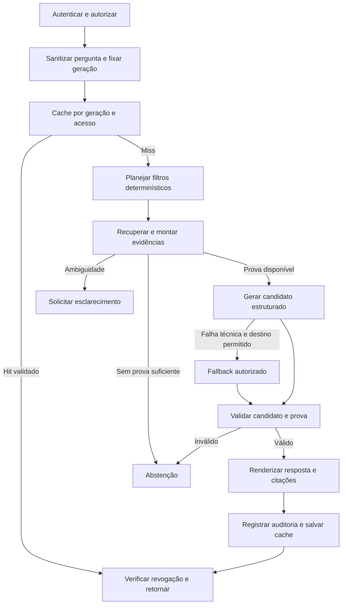

# Especificação: RAG jurídico verificável — Andrade Advogados

Data: 05/10/2026. Versão: 0.6. Estado: proposta corrigida para a segunda rodada adversarial formal; execução depende da aprovação do usuário e dos detalhes aplicáveis da seção 3.

Objetivo: transformar os componentes de preparação disponíveis em um serviço interno que recupera provas contratuais, responde com citações verificáveis e pode ser operado na AWS sob controle do escritório.

Esta especificação define comportamento e critérios de aceite. O [plano de execução](../../plans/2026-10-05-rag-juridico-producao.md) define a ordem das entregas. Não constitui homologação do corpus, autorização de novos destinos de dados nem liberação de produção.

Processo obrigatório da próxima execução: TDD (Red → Green → Refactor), evidências do gate e revisão de agente juiz em cada entrega/subentrega com gate próprio. O limiar técnico é score >=9 em escala 0–10, sem achado alto/crítico aberto; a [rubric formal](../reviews/2026-10-05-juizo-plano-rag.md) define os dez critérios. A execução aguarda a aprovação explícita do plano pelo usuário, posterior a esta revisão.

## 1. Base factual e limites da validação atual

Fontes lidas: [CONTEXT.md](../../CONTEXT.md), depois [HANDOFF.md](../HANDOFF.md), [auditoria inicial](../AUDITORIA_PREPARACAO_RAG_2026-10-05.md), relatórios das tarefas e dos portões, código, testes e estatísticas dos artefatos locais. O arquivo citado pelo usuário como CONTEXTO.md está nomeado CONTEXT.md neste repositório.

Snapshot de código: commit `f301970`. Verificação nesta sessão, com configurações isoladas do `.env`, chave fictícia, tracing desligado e conexões externas bloqueadas: **277 testes passaram; 1 teste de chamada real ao LLM foi excluído; 2 avisos de depreciação**. O HANDOFF registra 278 testes, mas não se reproduziu a chamada externa nesta sessão.

| Componente | Evidência atual | O que falta comprovar |
| --- | --- | --- |
| Extração e curadoria | 1.292 registros; 287 include, 944 exclude, 61 review; hashes do manifest e curadoria conferem com summary | Aprovação humana de conteúdo e cobertura das exclusões |
| Revisão humana local | 61 linhas de review e 31 de QA; nenhuma com decisão final e revisor preenchidos; overrides.csv ausente | Identificar eventual validação externa e importar seus registros; não concluir que nunca houve revisão |
| Parsing e reconciliação | Implementação e testes de DOCX, legados, PDF/OCR, partes e divergências | Piloto visual no corpus; 96 includes ainda sinalizados sem checagem de quase-duplicatas nas rotas legadas/PDF |
| Chunking | Hierarquia e verbatim_text implementados | Proveniência completa, partes estruturadas no resultado, identidade por conteúdo/configuração e tratamento de limites de tokens |
| Busca | Chroma + BM25, filtro de CPF/CNPJ, RRF, persistência e recarga testadas | Modelo semântico real, avaliação de relevância, isolamento por autorização e concorrência |
| Embedding | DeterministicHashEmbeddings por padrão | Vetorização por hashes não demonstra compreensão semântica; deve ficar restrita a testes |
| Gerações | Escrita de Chroma e depois BM25 na mesma pasta | Publicação atômica, verificação de paridade, rollback e falhas intermediárias |
| Agente | Grafo primário/fallback/erro implementado | Recuperação, contexto, validação de evidências e citações; prompt ainda presume a banca como contratada |
| Segurança | Sanitização e autenticação disponíveis | api_secret_key não está declarado em Settings; sem chave esperada a função admite acesso inclusive no caminho de produção |
| Telemetria | Mascaramento e callback implementados | Callback modifica dicionários recebidos e gerações de LLM; erros/metadados precisam de proteção na saída efetiva |
| API e operação | app/main.py, tests/test_api.py e README.md vazios; data/indices ausente | Serviço HTTP, testes de integração, índice operacional e implantação |

As aprovações de agentes nos relatórios históricos avaliam a entrega que examinaram. Não equivalem a aprovação humana dos contratos nem provam ausência de alucinação, conformidade jurídica integral ou capacidade de produção.

## 2. Produto, perímetro e resultado desta etapa

### 2.1 Comportamento esperado

- Usuário interno autenticado consulta contratos, aditivos, distratos, acordos, propostas de honorários e atos societários admitidos pela curadoria.
- Perguntas podem selecionar instrumento, parte/identificador e tema; compara-se mais de um instrumento somente com atribuição explícita das respectivas evidências.
- Cada conclusão contratual apresenta instrumento, partes reais, localização e trecho literal. A banca não é presumida como parte em documentos sob custódia.
- Falta de prova gera abstenção; ambiguidades relevantes geram pedido de esclarecimento; indisponibilidade técnica gera erro de serviço.
- A resposta se refere ao acervo autorizado e à geração consultada. Não declara inexistência de cláusula no original por ausência no top-k, nem vigência/assinatura sem evidência registrada.

### 2.2 Limites da versão inicial

Escopo: consultas fundamentadas e comparações documentais delimitadas; ingestão repetível; atualização e exclusão; API interna; operação de uma instância AWS com disco persistente; avaliação e trilha de auditoria.

Fora desta etapa: redigir contratos, emitir parecer jurídico, buscar legislação/jurisprudência na internet, integrar e-mail, escrever no M-Files, frontend, agentes autônomos com ferramentas, memória conversacional persistente e alta disponibilidade em múltiplas instâncias. `thread_id` permanece identificador de correlação; não promete memória nem concede acesso.

Preparação/OCR, prova documental, embeddings e índices permanecem no computador de desenvolvimento e, posteriormente, na infraestrutura AWS administrada pelo escritório. "Local" descreve o perímetro de processamento, não impede a migração autorizada para EC2. Envio de trechos à geração e envio de telemetria são fluxos distintos, com políticas próprias.

## 3. Decisões e governança

| ID | Decisão | Estado / responsável | Dependência que resolve |
| --- | --- | --- | --- |
| D01 | Manter OpenRouter; definir política de dados antes de consultas reais: modelos, fornecedores permitidos, região, retenção, treinamento, fallback e orçamento | Destino confirmado pelo usuário em 05/10/2026; política específica ainda pendente; a escolha do destino não autoriza antecipar consultas reais | Chamadas com perguntas/trechos reais e avaliação online |
| D02 | Mesmo acervo para colaboradores internos autenticados; sem ACL por cliente/caso na versão inicial | Confirmado pelo usuário em 05/10/2026; mecanismo de identificação/credenciais será definido no contrato de autenticação | Autorização interna, cache, auditoria e liberação de usuários |
| D03 | Revisão humana do conteúdo ainda será realizada; definir responsável por referência visual, versões e conteúdo crítico | Situação confirmada pelo usuário em 05/10/2026; revisor e registros de aceite serão organizados em P2 | Corpus aprovado e gabarito de avaliação |
| D04 | Região/conta AWS, acesso privado, integração consumidora, concorrência, orçamento mensal, retenção de provas/logs/backups, fonte durável de revogações e tolerância de indisponibilidade | Fonte de revogações definida antes do aceite operacional do mecanismo de P4; demais decisões antes de P8/P9 quando afetarem carga/liberação; metas provisórias na seção 10 | Infraestrutura e homologação operacional |
| T01 | Reutilizar os módulos existentes, corrigindo contratos que impedem a integração | Proposta técnica | Evitar duplicação dos parsers e regras |
| T02 | Embeddings locais; comparar pelo menos dois modelos reais em português com versões fixadas | Proposta técnica; modelo escolhido após benchmark | Qualidade e custo na CPU/RAM alvo |
| T03 | Publicar gerações imutáveis com ponteiro ativo; reconstruir BM25 por geração | Proposta técnica | Atualização consistente e rollback |
| T04 | Respostas estruturadas com prova resolvida pelo backend e texto final renderizado após validação | Proposta técnica | Citações confiáveis e explicabilidade |
| T05 | Chroma persistido para piloto local; validar Chroma como serviço privado na mesma EC2 para operação | Proposta técnica; confirmar recursos/compatibilidade no piloto | Ciclo de vida e concorrência de produção |

Decisões serão registradas com data, responsável, alternativa escolhida, justificativa, impacto e evidências. Mudança de destino/modelo não é simples troca de variável: exige revalidar o fluxo de dados e a qualidade.

Políticas do CONTEXT para inclusão/exclusão continuam vigentes. Informação de minutas excluídas não pode ser recuperada como contrato aprovado, apesar de o HANDOFF histórico mencionar busca de minutas.

É possível implementar interfaces, testes sintéticos e staging enquanto os detalhes dependentes de D01/D03/D04 são definidos. Consultas externas com conteúdo real dependem da política D01; promoção do corpus depende dos registros D03; habilitação de usuários depende do contrato de autenticação e de D04. Pendência não paralisa trabalho independente.

Na versão inicial, AccessContext representa principal técnico autenticado, permissão interna de consulta ao acervo aprovado e permissão separada de operação. Não implementar ACL de cliente/caso por antecipação. Filtros por cliente/parte são seleção de documentos e nunca mecanismo de autenticação. Se a integração usar chave compartilhada, a auditoria identifica o integrador e não atribui ações a uma pessoa sem identidade adicional confiável.

## 4. Requisitos do corpus e da prova documental

| ID | Requisito obrigatório |
| --- | --- |
| DATA-01 | A entrada de produção passa por load_curated com verificação de hashes; ingestão não faz sync implícito nem ignora estado stale |
| DATA-02 | Separar estado de parsing de elegibilidade: success técnico não significa documento aprovado; aprovação exige decisão de curadoria, controles de conteúdo e revisão aplicável |
| DATA-03 | Enumerar todos os arquivos de cada registro e usar file_id/rota de parsing registrada; nunca escolher silenciosamente o primeiro arquivo do diretório |
| DATA-04 | Registrar por arquivo: versão, hash, parser/configuração, estado e motivo; por instrumento: estado agregado e evidências da decisão |
| DATA-05 | Detectar placeholders/modelos, revisões controladas, numeração não resolvida, tabelas degradadas e OCR incerto; risco crítico sem adjudicação retém o instrumento |
| DATA-06 | Completar quase-duplicatas após parsing em todos os formatos, incluindo pares com títulos distintos e arquivos de formatos diferentes; similaridade sugere revisão, não elimina instrumentos automaticamente |
| DATA-07 | Duplicatas/versões são decididas com partes, datas, conteúdo e origem; documentos parecidos de partes diferentes permanecem distintos; não inventar versão final/vigência |
| DATA-08 | Persistir decisões humanas em registro durável e transacional, ligado a versão/hash/configuração, preservando histórico fora das amostras CSV; exports são derivados |
| DATA-09 | Pipeline produz relatório de cobertura: todo registro/arquivo termina em aprovado, revisão, falha ou exclusão explícita, com motivo; nenhum desaparece sem contabilização |
| DATA-10 | Originais são somente leitura; derivados e caches ficam em staging; reexecução determinística do conteúdo é distinguida de horários/IDs das execuções |
| DATA-11 | Identificadores preservam forma original e representação canônica tipada: CPF de 11 dígitos, CNPJ numérico existente e CNPJ alfanumérico de 14 posições; nunca remover letras ou converter identificador em número |
| DATA-12 | Registrar relações aprovadas/candidatas entre contrato-base, aditivos, distratos e instrumentos substitutivos, com unidades afetadas, prova, estado de resolução e bloqueio de condições aplicáveis quando houver conflito ou relação material pendente |

Estados propostos de parsing: parsed, failed. Estados de revisão/elegibilidade: pending, approved, review_required, excluded. Os motivos especializados existentes, como review_metadata_mismatch, passam a reason_codes com migração explícita. Sem migração concluída, manter o estado anterior e bloquear aprovação implícita.

Registro humano mínimo: decision_id, instrumento/arquivo, versão/hash, contexto da avaliação, decisão, reason_codes, revisor, reviewed_at, configuração/gabarito e supersedes_id. Proposta de armazenamento: SQLite local para decisões/auditoria; CSV/JSONL são exports. O armazenamento suporta recuperação e não depende da permanência do item na amostra de QA.

Para CNPJ alfanumérico, a normalização de busca remove somente a máscara prevista e converte letras para maiúsculas, mantendo as 12 posições alfanuméricas e os 2 dígitos verificadores. Extração, reconciliação, lookup, near_dup, schemas e proteção de telemetria usam o mesmo contrato. OCR não converte automaticamente O/0 ou I/1; inconsistências vão para revisão. Verificação de dígitos não altera o texto documental; identificador inconsistente é registrado como risco. A compatibilidade com o formato numérico do acervo existente permanece obrigatória. A Receita Federal documenta o novo formato e seu uso em 2026: [referência oficial](https://www.gov.br/receitafederal/pt-br/acesso-a-informacao/acoes-e-programas/programas-e-atividades/cnpj-alfanumerico).

### 4.1 Referência de fidelidade

Piloto de 30–50 documentos selecionados de forma reproduzível, com DOCX, DOC binário, RTF/WordPerfect disponíveis, PDF digital/escaneado/misto diagnosticado, tabelas, anexos, listas multinível, comentários e revisões. Incluir casos 5991, 5707 e 5829 se presentes no snapshot; ausência deve ser registrada, sem alterar o acervo.

Revisor do escritório compara originais renderizados a trechos extraídos. Não usar a saída do parser como único gabarito do próprio parser. Registrar parte, identificador, localização, valores, percentuais, datas, negações e condições. Na primeira liberação, a proposta é revisar o conteúdo crítico de todos os instrumentos efetivamente publicados; os demais permanecem em quarentena sem impedir um corpus inicial menor.

Auditar também uma amostra estratificada de exclusões e grupos de duplicatas para detectar falsos negativos. Definir tolerância e plano amostral antes de estimar erro populacional; separar essa amostra probabilística do conjunto adversarial.

### 4.2 Proveniência e literalidade

Cada bloco/chunk citável conserva documento, versão, file_id, hash do original, parser/configuração, block_ids, posição no texto canônico e origem física disponível: página e coordenadas em PDF/OCR; parte XML e posição de parágrafo/célula em DOCX. Conversões conservam ligação entre original e derivado, com hashes de ambos.

`verbatim_text` representa texto documental validado; `text_search` e cabeçalhos sintéticos são campos separados. Numeração reconstruída e contexto de tabelas precisam de origem e validação contra a visualização. Cabeçalho inserido pelo sistema não pode virar transcrição atribuída ao original. Separadores de blocos possuem mapa de origem; literalidade não é igualdade binária ao arquivo Word/PDF.

Não inventar número de página de Word. Quando não houver rótulo de cláusula, usar uma localização verificável de parágrafo/tabela/anexo. Se a localização necessária não puder ser comprovada, o trecho não é elegível como prova.

### 4.3 Relações entre instrumentos e consulta histórica

Um aditivo/distrato não é uma duplicata nem necessariamente nova versão M-Files do contrato-base. O texto-base não pode mencionar uma modificação futura; por isso o fechamento precisa consultar um registro de relações também na direção **base → modificadores**, independente do top-k semântico.

`InstrumentRelation` contém relation_id, from_instrument_id (instrumento modificador), to_instrument_id (base/precedente), relation_type (`amends`, `supplements`, `terminates`, `supersedes`), affected_unit_ids, support_unit_ids/spans, datas expressas no documento quando existentes, state (`proposed`, `approved`, `rejected`, `conflicted`), revisor/decisão, snapshot e configuração. O efeito material só é registrado quando sustentado e revisado; datas de download, versão ou cadastro não comprovam assinatura, início de efeitos ou prevalência.

Candidatos podem ser descobertos por referências textuais, identificação de instrumentos e metadados. Nome semelhante/mesmas partes/data recente não aprovam associação nem efeito automaticamente. A revisão identifica alcance da alteração, condições de produção de efeitos e unidades de suporte. `affected_unit_ids` desconhecidos impedem tratar a alteração como resolvida; conflito é estado explícito, não resolvido por ordenar datas.

O `RelationRegistry` tem consulta direta e inversa, histórico durável e estado de resolução por família/snapshot. Relações candidatas de documentos em review são sinais de risco, conservados no diagnóstico restrito, **nunca evidências publicadas**. Havendo suspeita material de modificador retido, base/riscos entram em adjudicação; não responder condição aplicável só com o base. Relação rejeitada por revisor deixa de bloquear; o histórico da rejeição permanece.

`QueryPlan` registra seleção de instrumento e `evidence_scope`: `original_text` quando o usuário solicita explicitamente o texto histórico do instrumento; `linked_instruments` como padrão para perguntas temáticas/condições. `reference_date` é opcional e deriva somente de data explicitamente solicitada. Pergunta por valor atual/aplicável não é convertida em busca exclusivamente histórica. Se a intenção temporal/associação for ambígua de forma material, esclarecer. Não presumir vigência do contrato em relação ao mundo externo ao acervo.

No escopo linked_instruments, o fechamento de cada unidade recuperada inclui unidades de base, modificadores, complementos, extinção/substituição pertinentes e respectivas condições aprovadas, mesmo quando nenhum chunk do modificador estava no top-k. A resposta extrativa apresenta disposições e alterações separadas por instrumento, com quatro elementos por prova; não fabrica um contrato consolidado nem aplica prevalência jurídica automaticamente. Uma condição resultante só pode ser apresentada como fato aprovado quando sua relação e efeitos documentais foram adjudicados, com suporte completo. Sem resolução suficiente, esclarecer/abster-se.

No escopo original_text, a transcrição identificada como histórica pode ser respondida com a unidade original; modificações aprovadas conhecidas recebem aviso factual e provas correspondentes quando pertinentes, sem reescrever o original. Esse aviso não transforma texto antigo em regra vigente. A falta de prova de um modificador não autoriza dizer que nunca existiu; se necessário para a pergunta, ocorre abstenção.

Relações e estados de resolução integram fingerprints, manifest de geração, prova e auditoria. Mudança de relação, nova descoberta material, modificação em review ou remoção/revogação de fonte de fechamento invalida cache e marca a família como pendente para consultas de condições aplicáveis até uma geração/resolução compatível. Esse bloqueio entra no policy_epoch/journal, impedindo que geração antiga ou rollback reabra condição incompleta. Consulta histórica só permanece disponível quando seu próprio suporte/acesso continuar aprovado.

Casos de aceite obrigatórios, sintéticos quando ausentes no corpus: base + aditivo sem referência recíproca no base; alteração parcial; distrato; modificadores conflitantes; associação não resolvida; modificador em quarentena; consulta explicitamente histórica; referência temporal sem prova de efeitos; fechamento excedendo orçamento; alteração de relação com cache hit/nova geração/rollback. Nenhuma pergunta de condição aplicável pode ser marcada answered apenas com base materialmente superado ou incerto.

## 5. Chunking, embeddings e publicação de índices

### 5.1 Unidade documental

Preâmbulo, cláusulas com seus parágrafos/incisos, anexos e tabelas são as unidades lógicas. `EvidenceChunk` conserva partes estruturadas, papel, instrumento, fonte, hierarquia, texto literal, mapas de origem e riscos adjudicados. Os metadados completos ficam no armazenamento canônico; Chroma recebe somente representações compatíveis necessárias à busca.

`chunk_id` deriva de fonte/versão, file_id/hash, intervalo ou conjunto de blocos e versão/configuração de chunking. `derivation_key` inclui manifest/decisões, relações/estados de resolução entre instrumentos, metadados efetivos, parsers, normalização, tokenização, chunking, modelo/revisão de embedding, dimensão e prefixos de consulta/documento. Não usar apenas doc_id/versão/posição do chunk como identidade de conteúdo.

Medir tokens com o tokenizer do embedding escolhido, incluindo cabeçalho. Se uma cláusula exceder o limite, dividir por subunidades jurídicas, mantendo parent_id, contexto e spans; nunca truncar silenciosamente. A prova canônica preserva a cláusula completa e suas relações. Orçamento do gerador é medido separadamente, reservando resposta e instruções.

**Unidade citável aprovada (`CitationUnit`):** conteúdo documental que pode ser apresentado sem retirar qualificadores materiais. Por padrão, uma cláusula completa, com todos os parágrafos/incisos e tabelas associados. Unidades de preâmbulo/anexo/tabela incluem os elementos de interpretação correspondentes; rótulos artificiais são identificados separadamente. Subunidade menor só é citável quando sua revisão registra contexto e dependências necessários. Referências a outra cláusula/anexo têm dependencies obrigatórias aprovadas; referência não resolvida que afete a conclusão impede a seleção. Não cabe ao gerador decidir se uma exceção pode ser omitida.

Cada unidade tem unit_id, source_ids, block_ids/spans, closure_unit_ids e estado de aprovação. Divisão para embedding conserva essa unidade lógica: vários chunks podem apontar para ela, mas citar um chunk não permite recortar seu texto arbitrariamente. O backend calcula o fechamento transitivo das dependências e das relações entre instrumentos conforme evidence_scope, detecta ciclos de forma finita e renderiza todas as unidades obrigatórias com suas localizações. Inexistência de fechamento aprovado, relação material conflitada/pendente ou orçamento insuficiente resulta em esclarecimento/abstenção; nunca em truncamento silencioso da prova.

### 5.2 Embeddings

Hash embeddings só são permitidos em testes. A configuração de produção exige provedor/modelo explícito, revisão, tokenizer, dimensão, licença, normalização e prefixos. Recarga recusa dimensão/configuração incompatível; erro de configuração não aciona download ou modelo substituto silencioso.

Benchmark de pelo menos dois candidatos locais reais, comparados ao BM25 no conjunto de desenvolvimento: Recall@k, acerto por identificador, tempo de ingestão, latência de consulta, pico de RAM e truncamentos. Medir no Windows e no ambiente Linux alvo. Modelo/pesos são escolhidos pelo desenvolvimento e congelados antes do teste reservado. Reranker é opcional, somente após demonstrar ganho e caber no orçamento.

### 5.3 Gerações e atualização

Artefatos locais planejados:

```text
data/staging/{run_id}/                 # derivados e relatório; sem publicação implícita
data/decisions/reviews.sqlite          # decisões versionadas; acesso restrito
data/indices/{generation_id}/
  manifest.json                       # configurações, fontes, hashes e cobertura
  chunks.jsonl                        # registros canônicos e proveniência
  chroma/                             # piloto persistido; produção usa coleção por geração
  bm25.joblib                         # artefato confiável gerado internamente
  checksums.json
  READY                               # escrito somente após verificações
data/indices/active.json               # ponteiro publicado por substituição atômica
data/audit/                           # trilha restrita; não exportada em traces externos
data/evaluation/                      # gabaritos e resultados; não versionar texto real no git
```

Construir em staging, persistir ambos os índices e a prova, verificar hashes e igualdade exata dos conjuntos de chunk_ids, recarregar e testar consultas. Só então marcar READY e trocar active.json. No modo servidor Chroma, o manifest aponta coleção exclusiva e imutável de geração; a publicação só ocorre após confirmação de paridade e disponibilidade dessa coleção.

Um escritor por corpus, com trava; IDs de geração não são reutilizados. Requisição fixa a geração durante o processamento. Falha antes da publicação preserva a anterior; corrupção impede recarga; falha de promoção permite recuperação sem servir geração parcial. joblib nunca recebe arquivo arbitrário de usuário e é carregado apenas de origem controlada com integridade verificada.

Os backends embedded e server usam interface explícita de armazenamento e identificação de coleção. O modo servidor privado planejado é implementado e testado em P4, antes da avaliação de busca/resposta. O modo embedded permanece para fixtures/piloto, sem ser o único caminho homologado. A avaliação final usa a topologia e as versões de produção; mudanças no backend obrigam repetir os gates funcionais afetados.

Atualização reconstrói a geração a partir dos aprovados, reutilizando derivados/embeddings somente quando os fingerprints coincidirem. Testar equivalência de construção completa versus reutilização, mudanças de metadados/configuração, inclusão, remoção, retorno para review e nova versão.

Revogação de credencial ou remoção de instrumento cria bloqueio após seu commit, também aplicado a cache, evidências e gerações anteriores; não esperar reindexação para impedir consulta. Nenhuma nova requisição admitida depois do commit pode usar o acesso revogado; requisições em curso revalidam o epoch da política antes de retornar e descartam resultados afetados. Rollback nunca restaura acesso revogado. Retenção do original para auditoria é uma decisão separada da disponibilidade para consulta.

O estado vigente de revogações tem fonte durável fora do domínio de falha do disco restaurado. Proposta AWS: journal restrito e versionado sob controle do escritório, com policy_epoch e bloqueios por source_id/credential_id, persistido antes de confirmar o commit; projeção local deriva dele. Escolher armazenamento em D04 e verificar acesso/integridade/recuperação. Restore de snapshot sozinho nunca libera consulta: reconciliar com journal/segredos/decisões vigentes e com o M-Files quando aplicável. Sem comprovar atualidade dos bloqueios, permanecer not ready. A meta de RPO do corpus não permite perder revogações já confirmadas.

## 6. Recuperação e seleção de evidências

- Autorização produz `AccessContext` no servidor; query, filtros ou thread_id fornecidos pelo cliente não podem ampliar esse contexto.
- Filtros explícitos do usuário e identificação de instrumento/CPF/CNPJ restringem candidatos dentro do universo autorizado, antes dos dois rankings. Identificadores selecionam partes do instrumento, não são prova de autorização nem de titularidade do cliente.
- Pedidos com múltiplos identificadores/instrumentos recebem semântica explícita de união/interseção por intenção; comparação mantém evidências por instrumento. Ambiguidade de seleção requer esclarecimento.
- Lookup exato atende identificadores de partes e de instrumentos. BM25 normaliza formas pontuadas/não pontuadas e termos jurídicos; a citação conserva o texto original.
- Dense + BM25 alimentam RRF determinístico; scores de BM25, distância vetorial e RRF não são probabilidades de verdade. Registrar ranks e configuração para reprodução.
- Recuperação não modifica parâmetros compartilhados por requisição. Busca síncrona/embedding/OCR não bloqueiam o event loop; usar execução limitada fora dele ou clientes async compatíveis. Ingestão e OCR não acontecem dentro de /chat.
- Falha de um índice não é silenciada: modo degradado deve ser explicitamente configurado, observável e avaliado. Padrão de produção: erro de disponibilidade quando o contrato híbrido não puder ser cumprido.
- Top-k limita candidatos, não demonstra cobertura integral. Expandir cláusula/parentes e evidências relacionadas quando necessário; se orçamento impedir responder toda a pergunta, esclarecer ou abster-se, sem omitir silenciosamente condições.
- Lookup inverso de relações aprovadas e riscos de família precede a montagem final da prova: não depender de BM25/dense para descobrir aditivo que altera o base recuperado. Registrar evidence_scope, reference_date e versão/resolução do registro de relações no plano/resultado auditável.

`RetrievalResult` interno: generation_id, query_plan_version, access_scope_digest, retrieval_config_version, evidence_ids, ranks/scores por componente, filtros efetivos, cobertura solicitada e retrieval_mode. O plano/filtros auditáveis contêm somente dados estruturados necessários, sem raciocínio interno do modelo.

## 7. Geração, validação e explicabilidade

### 7.1 Fluxo do grafo



Tratamento de falhas de serviço é um caminho distinto, com ErrorResponse; não é abstenção por ausência de prova. Sem evidências não há chamada ao gerador. Cache é verificado após autenticação e checagem de geração/acesso.

### 7.2 Contrato de geração

`GenerationCandidate` seleciona unidades/fatos aprovados por ID; **não admite proposições livres, texto de resposta, quotes ou spans escolhidos pelo modelo**. O backend resolve conteúdo, fechamento, partes/localização/hash e renderização no corpus. Saída estruturada deve ser validada por Pydantic, com extra=forbid, limites de cardinalidade e unicidade de referências, sem confiar em JSON sugerido pelo prompt.

| Campo do candidato | Tipo / regra executável |
| --- | --- |
| action | Enum select, abstain, clarify |
| selections | Lista de {unit_id: string, question_item_ids: lista de IDs da pergunta}; unit_id pertence ao conjunto oferecido e a referência deve ser única |
| approved_fact_ids | Lista opcional de IDs de fatos extraídos e revisados, oferecidos no contexto; valor e unidade nunca vêm do modelo |
| clarification_code | Enum de ambiguidade permitido, obrigatório somente em clarify; opções são resolvidas pelo backend |
| Campos adicionais | Rejeitados; não há campo claim/text/span/quote livre |

select exige ao menos uma unidade; abstain/clarify não podem conter seleções/fatos. IDs de itens da pergunta são emitidos pelo plano tipado de consulta, sem concessão de acesso. O backend valida que todos os itens materiais pedidos têm seleção ou produz resposta controlada de esclarecimento/abstenção. Fatos isolados só podem ser renderizados com suas unidades de suporte e fechamento aprovado.

A primeira versão usa apresentação extrativa: o gerador seleciona IDs de unidades citáveis; afirmações materiais são unidades íntegras e seu fechamento ou campos extraídos e aprovados com suporte, renderizados pelo backend. Prosa de ligação usa templates sem novas conclusões jurídicas. Síntese livre fica desabilitada até existir avaliação e controle específicos para sustentação semântica por afirmação.

Isso permite perguntas temáticas, localização e comparação lado a lado, mas não promete inferência jurídica. Negação, exceções, condições, valores e atribuição das partes não podem ser resumidos por retirada de qualificadores. Apresentar sempre o fechamento aprovado, independentemente do recorte recuperado. Integridade estrutural não prova relevância da seleção; relevância e completude continuam medidas contra o gabarito humano.

Conteúdo recuperado é dado não confiável para instruções: contratos não redefinem o sistema, revelam segredos nem autorizam ferramentas. Não inserir texto documental como instrução de sistema. Manter defesa de prompt injection na consulta e nos documentos; regex isolada não garante proteção.

### 7.3 Validação e montagem da resposta

| Checagem | Comportamento |
| --- | --- |
| Schema e referências | Rejeitar campos desconhecidos, unit_id/approved_fact_id inventados e referência não oferecida ao gerador; evidence_id das citações é resolvido pelo backend |
| Escopo e estado | Todas as fontes estão aprovadas/autorizadas na geração fixada e ainda não revogadas |
| Literalidade e fechamento | quote corresponde às unidades/spans canônicos do fechamento aprovado, escolhidos pelo backend; recorte arbitrário do gerador é rejeitado |
| Localização e partes | Resolução pela prova/metadata aprovada, com papéis reais; nenhum CPF de representante é promovido a identificador da empresa |
| Sustentação | Afirmações materiais provêm de extração aprovada ou trecho íntegro com condições; mera presença de aspas não comprova a conclusão |
| Cobertura | Detectar itens solicitados sem suporte e modificadores/efeitos materiais não resolvidos; aplicar fechamento base/modificadores conforme evidence_scope; não transformar texto histórico isolado em condição aplicável |
| Negativos | Não inferir ausência, validade, assinatura, vigência ou exclusividade a partir de ausência em resultados; abstenção expressa a limitação da busca |

Em candidato inválido: registrar reason_code e abster-se; não retornar o texto bruto. Fallback é para falhas técnicas do provedor, com mesmo contexto/políticas; não amplia corpus/destino nem tenta contornar falta de evidências.

O modelo primário/fallback atualmente configurado só será mantido após verificar disponibilidade, limites, suporte a saída estruturada, custos e política do fornecedor. Não presumir que os nomes cadastrados em Settings validam sua disponibilidade.

Explicabilidade significa fornecer provas, versão consultada, localização e resultado de validação. A trilha registra configurações, decisões estruturadas e estados; não registra nem expõe chain-of-thought interno.

## 8. Contrato HTTP, cache e segurança

Modelos Pydantic em app/models.py serão a autoridade executável dos payloads e do OpenAPI gerado. A tabela abaixo é o alvo da mudança; implementação/testes devem convergir para esse contrato e manter exemplos derivados dos schemas. Não há API implantada confirmada; verificar consumidores antes de alterar campos existentes.

| Operação | Comportamento |
| --- | --- |
| POST /chat | Autenticado; ChatRequest com message não vazia até 10.000 caracteres, thread_id de correlação com limite e filtros opcionais tipados de seleção; retorna resultado integral validado, sem streaming nesta versão |
| GET /health | Liveness mínima, sem chaves/modelos/caminhos/acervo; não verifica LLM remoto por requisição |
| GET /ready | Somente perímetro interno; readiness de configuração, corpus aprovado e índices/embedding compatíveis; 503 se não pronto |
| GET /metrics | Restrito a operador; contadores agregados, latência, tokens, cache, estados e erros; sem perguntas, nomes ou identificadores de partes |

ChatResponse conserva response, thread_id, model_used (nullable se não houve geração), cached, processing_time_ms e timestamp. Acrescenta request_id, status (`answered`, `abstained`, `needs_clarification`), corpus_generation_id, citations e reason_code tipado quando aplicável.

`Citation`: citation_id, contract_id, contract_title, document_version, parties (name e role provenientes de revisão), location (clause/paragraph/annex e página quando real), quote, source_id e evidence_id. `quote` vem da prova canônica. IDs de fonte são opacos; não retornar caminho absoluto, credencial ou URL de download irrestrita. Hash e spans detalhados ficam na auditoria interna.

Invariantes: answered tem ao menos uma citação e todas as proposições materiais sustentadas; abstained/needs_clarification têm citations vazias e mensagem controlada; falhas técnicas retornam ErrorResponse com request_id/code, sem stack trace ou texto de exceção externa. Abstenção usa a política do CONTEXT para informação não localizada; status e geração deixam claro o limite do corpus. Esclarecimento apresenta apenas opções provenientes do universo autorizado.

HTTP: 401 para chave ausente/inválida; 403 para recurso explicitamente proibido quando isso não revelar sua existência; 422 para payload; 429 com Retry-After para limite; 503 para serviço/modelos/corpus indisponíveis; 504 para orçamento de tempo excedido. Ausência de prova é 200 com abstained. Falha interna é 500 com mensagem genérica e correlação.

Auth falha de forma fechada: produção sem segredo/política válida não inicia pronta; não existe credencial de fallback. Chaves ficam como SecretStr, comparação em tempo constante e rotação prevista. O contrato de autenticação define credencial do integrador/colaborador e permissão de operação conforme D02; chave compartilhada não fornece atribuição individual confiável. Não inventar identidade humana a partir de IP/thread_id.

Limites aplicam-se a principal e perímetro conhecido; respeitar proxy confiável, tamanho do corpo, fila e concorrência. Logs não contêm API keys, perguntas ou PII. CPF/CNPJ, valores e tipografia jurídica permanecem no processamento autorizado; segurança não apaga prova contratual.

Cache em memória limitado por entradas/tamanho, TTL inicial de 300 s e proteção de concorrência. Chave: pergunta normalizada sem alterar identificadores/semântica, filtros, geração, principal/escopo/policy_version, retrieval_config, prompt/validator_version e configuração de modelos/provedores. Invalidar em mudanças relevantes e revogação; cache hit repete verificação de acesso. Nunca cachear erros, candidatos inválidos ou respostas sem validação. Redis não é requisito da instância inicial.

## 9. Observabilidade e auditoria

Telemetria externa é uma projeção por allowlist do evento, criada sem mutação do input/output do pipeline. Não basta trocar valores de CPF/CNPJ por regex: nomes, e-mails, endereços, cláusulas e mensagens de exceção também podem revelar conteúdo. Exportação desconhecida é bloqueada.

Allowlist inicial: request_id aleatório, nomes fixos de nó, versões opacas de configuração/geração, estado/reason_code, latência, contagem de evidências/tokens, cache hit, modelo/provedor aprovado e categoria fixa de erro. IDs documentais originais, PII, consultas, provas, títulos e arquivos ficam fora. Campos/tags/metadata/erros/serialização e nós filhos passam pela mesma política.

Configurar hide_inputs/hide_outputs antes de clientes e tracing; usar cliente/tracer explicitamente protegido e capturar o payload HTTP efetivamente emitido em testes. Callback local não prova sanitização do exportador LangSmith. Falha do exportador não libera dados crus nem compromete a resposta.

Auditoria restrita local conserva geração, evidências/spans/hashes, decisões, políticas, versões e resultado da validação, suficientes para reconstruir a resposta. Conteúdo sensível só aparece onde necessário, com acesso, retenção e backup definidos por D04. IDs opacos de telemetria não são credenciais.

Medir por nó, p50/p95/p99 do serviço, tokens/custo quando disponíveis, cache, abstenção, esclarecimento, falhas técnicas, fallback, falhas de grounding, documentos em quarentena e idade do corpus. Custo indisponível é null, não zero estimado sem base. Não usar PII como label de métrica nem tratar alta taxa de abstenção isoladamente como sucesso.

## 10. Avaliação e critérios de aceite

Os números abaixo são **metas propostas**, não resultados alcançados. Gabarito é elaborado/revisado por pessoa responsável do escritório; avaliador LLM é auxiliar e não decide sozinho fidelidade ou verdade jurídica.

Conjuntos mínimos separados: **desenvolvimento com >=50 perguntas e teste reservado de homologação com >=100 perguntas distintas**, estratificadas por formato, tema e instrumento. No teste reservado, exigir >=20 casos sem suporte, >=20 que dependam de condições/múltiplos trechos, >=10 ambiguidades críticas e >=20 seleções por identificador/instrumento; categorias podem se sobrepor, mas haverá >=60 perguntas respondíveis para ACC-02/ACC-05. O desenvolvimento não conta para esses denominadores.

Incluir no teste reservado todas as rotas presentes no corpus de lançamento, com >=5 casos por rota disponível; representar terceiros, aditivos, versões, exceções e identificadores pontuados/sem máscara. Se estrato obrigatório não existir no corpus, registrar a lacuna e adicionar fixture sintética específica, contabilizada separadamente. Compatibilidade com CNPJ alfanumérico, ataques, revogação e recuperação tem suites sintéticas adicionais quando não houver casos reais; estas não substituem os mínimos documentais.

Desenvolvimento e teste são separados por instrumento/família e grupos de duplicatas/versões para evitar vazamento. Snapshot e split são congelados antes da seleção de modelos/pesos, sem ajuste sobre o teste. Perguntas diferentes da mesma família não ficam em conjuntos distintos.

Cada pergunta registra qid, pergunta, split, snapshot, escopo autorizado, tipo de resposta esperado, evidence_scope/reference_date esperados, instrumentos/evidence spans necessários, relações pertinentes, unidades diretamente relevantes, dependências materiais obrigatórias e revisão. Famílias conectadas por aditivos/distratos/relações também permanecem no mesmo split. Fonte/gabarito real fica em data/evaluation; fixtures sintéticas e schemas ficam no git. Relatório publica denominadores, erros por estrato, intervalo de incerteza e versão das configurações; não extrapola resultado da amostra como garantia universal.

**Precisão de seleção/apresentação:** o gabarito humano distingue unidades diretamente responsivas, suporte/qualificadores/modificadores obrigatórios e unidades sem relação. Para cada pergunta, Precision_selected = unidades primárias selecionadas pertinentes / unidades primárias selecionadas; Precision_emitted = unidades apresentadas pertinentes ou necessárias ao fechamento / todas as unidades apresentadas. Uma dependência material corretamente adicionada não é ruído; boilerplate ou outra cláusula independente sem relação é. Avaliar unidades lógicas, não fragmentos de embedding; repetir a mesma unidade não aumenta acertos e constitui falha de apresentação.

Reportar agregação micro (soma de numeradores/soma de denominadores), macro por pergunta com denominador não vazio e por estrato. Meta >=95% para micro e macro de ambas as medidas no teste reservado; mínimo de 50 seleções primárias e 50 unidades apresentadas observadas. Denominador vazio é N/A, nunca 100%, e abstenção em pergunta respondível continua erro em ACC-05. Seleções irrelevantes não aprovam pergunta como completa/correta. Tuning usa só desenvolvimento; a referência pode admitir unidades alternativas equivalentes, adjudicadas sem transformar saída do modelo em gabarito.

| ID | Medida e denominador | Meta / condição |
| --- | --- | --- |
| ACC-01 | Divergências críticas na referência visual (parte, número, valor, percentual, data, negação, condição, revisão ou tabela) | Zero; 100% dos spans citáveis rastreáveis; ocorrência bloqueia documento/rota afetada |
| ACC-02 | Spans necessários integralmente cobertos pela união dos dez chunks finais antes de expansão / spans necessários no gabarito respondível; também macro por pergunta e todos-os-trechos por pergunta | Recall@10 >= 95% em >=60 perguntas respondíveis; reportar BM25, dense e híbrido separadamente; cobertura após expansão é métrica adicional, não altera esse denominador |
| ACC-03 | Seleção por identificador nos casos elegíveis com identificador aprovado; inexistentes/ambíguos medidos separadamente | 100% do instrumento/escopo esperado; nenhuma ampliação por falha de filtro |
| ACC-04 | Citações válidas / citações emitidas (literalidade, origem, localização, partes, autorização e atualidade) | 100%; caso answered sem citação é falha, não denominador vazio |
| ACC-05 | Afirmações materiais sustentadas / afirmações materiais emitidas; respostas completas corretas / perguntas respondíveis | 100% de sustentação observada e >= 90% de respostas completas corretas no teste; abstenção em pergunta respondível conta como falha de completude |
| ACC-06 | Casos negativos com afirmação sem suporte / casos negativos; pedidos que exigem esclarecimento corretamente classificados | Zero afirmação sem suporte; 100% dos casos de ambiguidade crítica esperados tratados sem escolha arbitrária |
| ACC-07 | Testes de acesso cruzado, cache, revogação, rollback e prompt injection | Zero evidência ou dado proibido nos cenários testados; nenhum teste tratado como garantia universal |
| ACC-08 | Paridade dos conjuntos/conteúdo dos índices; publicação interrompida; recarga/rollback | Igualdade exata; anterior permanece servível; geração parcial nunca ativa |
| ACC-09 | Payloads efetivamente exportados de tracing/logs, incluindo falhas e callbacks; equivalência com tracing desligado | Zero conteúdo sensível nos payloads capturados; resposta/prova inalteradas pela instrumentação |
| ACC-10 | Carga proposta de 5 consultas concorrentes por 30 min, após aquecimento, mistura registrada; cache-hit e miss separados | Retrieval p95 <= 1 s, /chat miss p95 <= 15 s sem falhas induzidas, erros técnicos < 1%, nenhuma resposta inválida; metas a confirmar em D04 |
| ACC-11 | RAM da pilha completa, aquecimento do servidor, geração ativa/candidata coexistentes, promoção/reload e pico de ingestão | Sem OOM/swap excessivo, consulta inicial <= 12 GB de RSS combinado na EC2 de 16 GB; medir transição entre gerações e agendar/limitar ingestão para não comprometer serviço |
| ACC-12 | Recuperação e atualização | Restore em ambiente limpo com paridade/consultas de prova; RPO proposto <= 24 h e RTO <= 4 h; validar D04; revogação imediata independe do RPO |
| ACC-13 | Precision_selected e Precision_emitted, micro/macro/estrato, com denominadores e relevância humana definidos acima | Micro e macro >=95% em ambas, >=50 seleções e >=50 unidades apresentadas no teste reservado; não penalizar fechamento material obrigatório |
| ACC-14 | Relações entre instrumentos e distinção entre consulta histórica/condição aplicável | 100% dos casos obrigatórios da seção 4.3 tratados com fechamento ou esclarecimento/abstenção; zero resposta completa de condição aplicável baseada apenas em regra histórica materialmente alterada/incerta |

Orçamento proposto de requisição: 30 s totais incluindo fila, primário, fallback e validação; não permitir que retries individuais ultrapassem esse limite. Limites de tokens, chamadas e custo são configuráveis e medidos. Meta de latência não obriga reduzir fidelidade nem habilitar envio externo não aprovado.

## 11. Operação AWS e recuperação

Base: uma EC2 Linux de 16 GB com EBS criptografado sob KMS e acesso controlado; API e Chroma no mesmo perímetro, BM25/prova local. Containers reprodutíveis com lock de dependências, LibreOffice e Tesseract/por fixados; serviço Chroma privado, sem porta aberta à internet. Parsing pesado tem execução separada da API.

Preferir acesso privado via rede/VPN já adotada pelo escritório, TLS, Security Groups mínimos, IAM role e segredos via mecanismo AWS escolhido. Administração por Systems Manager Session Manager quando disponível; não depender de SSH público. Região e eventuais endpoints/egress são decididos em D04. Nenhum serviço AWS ou custo é criado durante o planejamento.

Chroma como servidor próprio é proposto por recomendação de produção da documentação; piloto embutido não prova o comportamento do servidor. Decisão final depende de compatibilidade da versão fixada, paridade e consumo na instância; registrar exceção se a opção embutida for mantida, com motivo e teste de concorrência.

Runbook: bootstrap sem segredos em imagens, instalação de modelos, build de corpus, promoção, atualização, revogação, rollback, falha de provedor, indisponibilidade de índices, coleta de incidentes sem PII e restore. Backup consistente considera índices, prova, decisões e bloqueios de revogação; snapshots de EBS ou cópias controladas são verificados por restauração. Backup criptografado em conta do escritório tem acesso/retenção próprios.

Health/readiness separam processo vivo de aptidão de resposta. Falha do LLM remoto não deve reiniciar repetidamente o processo; fila/concurrency budget limita carga. Uma instância não oferece alta disponibilidade; D04 deve confirmar esse limite ou abrir etapa adicional.

Antes do aceite AWS, repetir no Linux/Chroma servidor os gates de paridade/publicação/recarga, busca por filtros, citação/fechamento, autorização/revogação/cache, payloads de tracing e concorrência. Smoke test sozinho não substitui esses gates. Cenário obrigatório de restore: backup → revogação confirmada → perda de disco/instância → restauração do backup → recuperação da fonte atual de bloqueios → consulta. Quando a fonte atual estiver indisponível, o resultado esperado é 503/not ready, jamais reabertura do documento/chave.

## 12. Referências técnicas verificadas nesta sessão

As escolhas acima são propostas de engenharia apoiadas nas fontes abaixo; não são promessa de resultado nem parecer legal. Disponibilidade e APIs são novamente verificadas na implementação contra as versões fixadas.

- [LangSmith — masking inputs/outputs](https://docs.langchain.com/langsmith/mask-inputs-outputs): controles do cliente, ocultação de inputs/outputs e orientação para não mutar objetos de origem. Requisito adicional deste projeto: verificar também erro/metadata e o payload exportado.
- [LangChain — structured output](https://docs.langchain.com/oss/python/langchain/structured-output): saída validável por schema. Estrutura válida não comprova sustentação semântica; por isso existe validação documental separada.
- [FastAPI — concurrency](https://fastapi.tiangolo.com/async/): distinção entre execução síncrona e assíncrona; desenho prevê isolamento das operações bloqueantes.
- [Chroma — Python clients](https://docs.trychroma.com/reference/python/client): recomenda cliente com servidor para produção; dados permanecem na EC2 controlada pelo escritório, sem adotar Chroma Cloud.
- [Amazon EBS — encryption](https://docs.aws.amazon.com/ebs/latest/userguide/ebs-encryption.html): base para criptografia de volumes/snapshots; políticas de acesso, retenção e restore continuam requisitos próprios.
- [AWS — Session Manager](https://docs.aws.amazon.com/systems-manager/latest/userguide/session-manager.html): opção de administração com controle IAM sem abrir portas de entrada para administração.
- [OpenRouter — data collection](https://openrouter.ai/docs/guides/privacy/data-collection): tratamento do roteador e dos fornecedores são camadas diferentes; D01 exige configuração de logging, fornecedores e retenção, inclusive fallback.
- [Amazon Bedrock — data protection](https://docs.aws.amazon.com/bedrock/latest/userguide/data-protection.html): referência para avaliar a alternativa AWS, caso escolhida; hospedagem AWS não constitui autorização automática de envio de dados.
- [Receita Federal — CNPJ alfanumérico](https://www.gov.br/receitafederal/pt-br/acesso-a-informacao/acoes-e-programas/programas-e-atividades/cnpj-alfanumerico): compatibilidade do formato nos identificadores de partes, buscas e controles de dados; preservar também os CNPJs numéricos existentes.

Revisão de desenho: duas rodadas por agente revisor; quatro achados altos da primeira versão corrigidos e rechecados, sem bloqueio alto/crítico remanescente no planejamento. Ajustes menores de nomes dos IDs e momento de D04 incorporados na versão 0.4. A revisão não homologa corpus, código futuro nem operação AWS.
