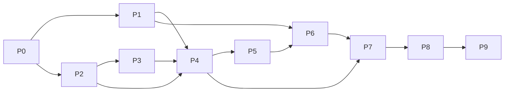

# Plano de implementação — RAG jurídico verificável

Data: 05/10/2026. Estado: proposta corrigida para a segunda rodada adversarial formal; execução depende da aprovação do usuário. Versão: 0.6.

Autoridade de comportamento e aceite: [specs desta etapa](../docs/specs/2026-10-05-rag-juridico-producao.md). Contexto histórico: [CONTEXT.md](../CONTEXT.md), [HANDOFF.md](../docs/HANDOFF.md) e [auditoria anterior](../docs/AUDITORIA_PREPARACAO_RAG_2026-10-05.md).

## 1. Resultado e ponto de partida

Entregar API interna com recuperação híbrida do corpus aprovado, citações verificáveis, abstenção, segurança, cache versionado, auditoria e pacote de operação EC2. Desenvolvimento e validação inicial são locais; implantação AWS constitui a última entrega condicionada a configuração e aceite operacional.

Snapshot inspecionado: `f301970`. A preparação tem componentes implementados, mas nenhum índice operacional em data/indices. Foram reproduzidos **277 testes offline passando, 1 teste online excluído e 2 avisos de depreciação**, sem chamadas externas nem leitura de segredos. CONTEXT contém estados de implementação anteriores; HANDOFF descreve a entrega seguinte, ainda sem execução integral registrada.

287 includes são candidatos: 191 DOCX, 64 legados e 32 PDFs. A revisão local não contém decisões humanas preenchidas; 96 includes ainda têm checagem de quase-duplicatas pendente nos artefatos. Reaproveitar código e comprovar os controles que faltam, evitando interpretar o aceite histórico de agentes como liberação documental.

## 2. Decisões que orientam a execução

D01–D04 estão definidos na seção 3 das specs. O usuário confirmou em 05/10/2026: **manter OpenRouter, com política de dados definida antes das consultas reais; mesmo acervo para colaboradores internos; revisão humana ainda será realizada**. Faltam a política específica de provedores/dados, a organização dos registros/revisor e o perfil operacional AWS. Não presumir aprovação pelo decurso do tempo.

Tarefas independentes avançam com fixtures sintéticas, interfaces de provedor e staging. Conteúdo real só sai do perímetro para destino aprovado; versão pública do repositório só contém código, schemas e exemplos sintéticos. Nenhum segredo, contrato, gabarito real ou artefato de produção entra em commit/PR.

O plano implementa inicialmente respostas extrativas verificadas. Síntese jurídica livre e memória persistente demandam specs adicionais. Isso evita que um verificador de citações seja tratado como detector infalível de alucinação semântica.

## 3. Dependências e portões

| Entrega | Dependências | Portão de avanço |
| --- | --- | --- |
| P0 — Contratos e baseline repetível | Specs; decisões necessárias registradas antes dos caminhos dependentes | G0: testes isolados, schemas e critérios revisados |
| P1 — Segurança e telemetria sem mutação | P0 | G1: autenticação fechada e payloads sanitizados capturados |
| P2 — Corpus, piloto e aprovação | P0; D03 para revisão do conteúdo real | G2: fidelidade/proveniência e controles de conteúdo comprovados |
| P3 — Embeddings, chunking e benchmark | P0 + candidato de corpus/gabarito de desenvolvimento de P2 | G3: modelo e orçamento fixados; nenhuma perda silenciosa de texto |
| P4 — Gerações, índices e publicação | P1 + P2 + P3; escolha D04 do journal antes do aceite operacional de revogação | G4: paridade, falhas intermediárias, recarga, remoção e rollback |
| P5 — Recuperação avaliada | P4; D02 para política final | G5: Recall/identificadores e isolamento aprovados |
| P6 — Grafo e prova de resposta | P1 + P5; D01 antes de usar dados reais com provedor | G6: citações, sustentação, cobertura, abstenção e fallback |
| P7 — API, cache e integração | P1 + P4 + P6; D02 | G7: contrato HTTP, concorrência e cache/atualização |
| P8 — Homologação ponta a ponta | P2–P7; D01–D03 resolvidos para o corpus lançado | G8: teste reservado, revisão de erros, qualidade e carga |
| P9 — Operação AWS e liberação | P8; D04 | G9: rede/segredos, restore, smoke test e aceite operacional |



P1 e preparação de P2 podem avançar independentemente após P0; infraestrutura documental de P9 pode ser desenhada antes de P8, sem publicar serviço. Não há delegação automática da execução. P0 altera contratos compartilhados e precisa terminar antes de edições dependentes; P2 e P3 coordenam alterações de chunker/schemas. Sequência recomendada para um único executor: P0 → P1 → P2 → P3 → P4 → P5 → P6 → P7 → P8 → P9.

Cada entrega é uma unidade de revisão. Dividir em subentregas se o diff combinar mudanças independentes demais; não antecipar implementação de uma entrega cujo contrato anterior continua instável. Gates de código com fixtures podem passar antes da validação real, mas isso não passa o gate documental/operacional correspondente.

## 4. Entregas executáveis

### P0 — Fixar contratos e tornar a verificação reproduzível

**Contexto autossuficiente:** a API ainda não existe, o grafo não recupera documentos e success de parsing é o único filtro atual de chunking. As specs exigem evidência tipada, estados distintos e testes sem chamadas reais implícitas.

**Arquivos:** app/config.py, app/models.py, app/ingestion/schemas.py, tests/conftest.py, tests/test_agent.py; novos schemas de evidência/candidato apenas se a separação modular for necessária.

**Tarefas:**

1. Definir AccessContext, EvidenceChunk, CitationUnit/fechamento, InstrumentRelation/RelationResolution, QueryPlan com evidence_scope/reference_date, RetrievalResult, GenerationCandidate de IDs selecionados (sem texto/proposições/spans livres), Citation e novos estados de aprovação, com migração explícita dos modelos existentes.
2. Declarar configuração validada de auth, provedores, corpus, embedding, índices, orçamento de tempo/custo, tracing e ambiente; segredos como SecretStr. Evitar criar cliente/serviço no import.
3. Tipar filtros de seleção, contratos HTTP e erros; gerar OpenAPI a partir dos modelos na futura API. Identificar qualquer consumidor existente antes de retirar campos. AccessContext tem escopo interno comum e permissão de operação; não construir ACL por cliente/caso nesta versão.
4. Isolar tests do `.env`, bloquear rede externa no perfil offline, deixar chamada real em marker online e skip por padrão, com habilitação explícita e fixtures sintéticas. Registrar versões e dependências fixadas.
5. Criar esqueleto do dataset com rubric e split por família/grupo de duplicatas/instrumentos relacionados: >=50 perguntas de desenvolvimento e >=100 no teste reservado com a composição das specs, incluindo relevância de unidades/fechamento e os cenários de aditivo/distrato, sem dados reais no git; registrar D01–D04. Definir normalização canônica de CPF/CNPJ numérico e alfanumérico, sem apagar letras; aplicar esse contrato nas entregas de extração, busca e telemetria.

**Verificação após implementação:** `uv run pytest -q -m "not online"`; `uv run pytest -q -m "not online" tests/test_schemas.py tests/test_agent.py`; validação dos schemas dos exemplos sintéticos.

**Saída/G0:** contratos executáveis e fixtures concordam; baseline offline reproduzível; nenhuma chamada externa por import/coleta; alterações de compatibilidade documentadas.

**Recuperação:** reverter o diff de contratos antes de consumidores migrarem; fixtures de modelos antigos continuam disponíveis durante a transição. Não alterar curadoria/originais.

### P1 — Fechar autenticação e proteger o exportador de observabilidade

**Contexto autossuficiente:** verify_api_key admite acesso sem segredo esperado, e SafeLangSmithCallbackHandler modifica objetos do pipeline e conserva mensagens de erro. Correção precede uso de provas reais no grafo.

**Arquivos:** app/security.py, app/config.py, app/monitoring.py, tests/test_security.py, tests/test_pii_redaction.py; novos testes de exportação/interferência.

**Tarefas:**

1. Falhar startup/readiness de produção sem auth válido; comparação segura, principal tipado, rotação e escopo; separar o perfil sintético de testes do modo de produção.
2. Implementar projeção por allowlist, sem mutar prompts, inputs, outputs ou LLMResult. Proteger também tags, metadata, serialized, exceções, logs e nós filhos.
3. Configurar cliente/tracer protegido antes de sua criação e capturar eventos na fronteira HTTP usando transporte simulado; não afirmar que callback local sozinho controla LangSmith.
4. Corrigir logs do retriever que imprimem identificadores e erros externos; métricas usam categorias fixas, sem PII. Cobrir também CNPJ alfanumérico e os formatos legados nas fixtures.

**Verificação:** `uv run pytest -q tests/test_security.py tests/test_pii_redaction.py tests/test_monitoring.py`; testes sintéticos de captura do exportador e igualdade da resposta com tracing ligado/desligado.

**Saída/G1:** requisitos ACC-07 e ACC-09 nos cenários deste gate; ausência/chave inválida/configuração ausente não permitem acesso; nenhuma mutação dos objetos de origem.

**Recuperação:** desligar exportação externa se o exportador falhar; preservar métricas locais mínimas. Falha de segurança impede habilitar serviço, sem retornar à autenticação permissiva.

### P2 — Operacionalizar a preparação e comprovar o corpus candidato

**Contexto autossuficiente:** a implementação de parsing existe, mas escolhe arquivo por fallback e só retém certas divergências. É preciso juntar resultados, curadoria, risco e revisão humana antes de produzir chunks aprovados.

**Arquivos:** app/ingestion/parsing_pipeline.py, schemas.py, reference_sample.py, near_dup.py, curation.py; novos content_validation.py, review_store.py e batch.py; testes correspondentes. Nomes novos são proposta de organização, não módulos já existentes.

**Tarefas:**

1. Preflight local registra versões de LibreOffice/Tesseract/por, parser/configuração e hashes; verifica snapshot/rotas sem sync nem alterações de originais. Isolar conversão/OCR com timeout e limite de processos.
2. Entrada exclusivamente por load_curated; iterar todos os arquivos e registrar estados completos. Usar rota/magic bytes registrados, não extensão/ordem do diretório como única autoridade. Atualizar extração/reconciliação/near_dup para identificadores canônicos numéricos e alfanuméricos, com regressão de todos os formatos anteriores.
3. Implementar ledger transacional de revisão com import/export compatível ao CSV; persistir decisões que saiam das amostras; aprovação obsoleta não acompanha automaticamente nova versão/hash.
4. Completar checagem de placeholders, revisões, tabelas/OCR/numeração e quase-duplicatas de formatos/títulos diferentes; mandar suspeitas para review sem decidir equivalência automaticamente.
5. Selecionar piloto estratificado, gerar relatório e material de comparação com original. D03 define/reconhece revisor e validação anterior. Preparar gabaritos independentes do parser.
6. Após validar as rotas do piloto, processar o lote em staging; exportar por instrumento e arquivo: aprovado/review/falha/exclusão e motivo. Separar sucesso técnico da elegibilidade; revisar conteúdo crítico do subconjunto que será lançado.
7. Descobrir/propor e revisar vínculos de alteração/complementação/extinção/substituição e unidades afetadas entre base/aditivos/distratos; manter estados proposed/approved/rejected/conflicted e prova. Não confundir associação com duplicata nem resolver efeito pela data. Registrar suspeita material de modificador em quarentena para bloquear condição aplicável, sem publicar esse conteúdo.

**Comandos propostos a implementar, não disponíveis hoje:**

```text
uv run python -m app.ingestion.batch preflight
uv run python -m app.ingestion.batch pilot --sample-size 40
uv run python -m app.ingestion.batch run --staging-only
```

**Verificação:** suites existentes de parsing/metadata/reconciliação e novos testes de ledger/content_validation/batch; `uv run pytest -q tests/test_parsing_pipeline.py tests/test_metadata_extractor.py tests/test_curation_hardening.py`; relatório do piloto com ACC-01 e inventário completo DATA-09.

**Saída/G2:** fonte/prova rastreáveis; nenhum risco crítico publicado sem adjudicação; nenhum arquivo omitido; aprovação real e relações/riscos registrados para o corpus lançado. Família com relação material pendente permanece bloqueada para condições aplicáveis. Os 61 review não precisam ser todos resolvidos para lançar um subconjunto aprovado.

**Recuperação:** preservar snapshot; descartar somente derivados identificados de execução interrompida conforme política; nenhuma exclusão recursiva de originais. Decisões históricas permanecem, com supersessão explícita.

### P3 — Escolher embeddings e ajustar chunks sem perda de prova

**Contexto autossuficiente:** índices atuais usam hashes por padrão e chunks sem file_id/spans/partes completas. Um modelo real pode truncar cláusulas que parecem pequenas em caracteres; medir o tokenizer é obrigatório.

**Arquivos:** app/ingestion/chunker.py, schemas.py, app/retrieval/embeddings.py, app/evaluation/retrieval.py, config.py, testes de chunker/embeddings e fixtures sintéticas.

**Tarefas:**

1. Acrescentar proveniência, partes aprovadas, mapa de spans, identidades por conteúdo/configuração e separação de texto documental/cabeçalho/contexto sintético. Materializar CitationUnit, dependências e ligações base → modificadores, com fechamento obrigatório conforme escopo histórico/instrumentos relacionados. Relações/resolução entram nos fingerprints.
2. Inventariar tokens/cláusulas; implementar divisão por subunidades para limites reais, com parent_id/expansão e sem truncamento oculto.
3. Comparar ao menos dois embeddings locais com versões/licenças e RAM/CPU registrados; hashes bloqueados no perfil de produção. Downloads de pesos são etapa explícita, sem envio de corpus.
4. Usar apenas desenvolvimento para escolha, parâmetros e orçamento; registrar modelo/tokenizer/dimensão/prefixos e fingerprints. Preparar dados reservados sem examiná-los para ajuste. Medir cobertura e relevância de unidades; benchmark de recuperação não substitui Precision_selected/Precision_emitted da resposta.
5. Usar integração mantida de Chroma conforme compatibilidade no uv.lock, tratando os avisos atuais de depreciação sem migração abrangente não justificada.

**Verificação:** `uv run pytest -q tests/test_chunker.py`; novas suites de embeddings/fingerprint/oversize; benchmark de desenvolvimento reproduzível em `data/evaluation/` com tempos e pico de memória.

**Saída/G3:** escolha fundamentada em busca real e recursos; prova preservada em todos os casos; recarga recusa incompatibilidade; dimensões/tokens/prefixos e configuração fixados. O benchmark é evidência de desenvolvimento, ainda não o aceite no teste reservado.

**Recuperação:** preservar configuração anterior e artefatos do benchmark; nova configuração produz nova derivação/geração, sem substituir índice ativo.

### P4 — Construir, recarregar e publicar uma geração consistente

**Contexto autossuficiente:** build_and_save_hybrid_index grava Chroma e BM25 sequencialmente. Uma pasta ou generation_id comum não implementa commit/rollback; estes controles precisam ser construídos.

**Arquivos:** app/retrieval/indexer.py, novo generations.py, pipeline batch, config.py; testes de geração, persistência, publicação e atualização.

**Tarefas:**

1. Implementar interface explícita embedded/server e o backend Chroma servidor privado no ambiente local/Linux de validação, com coleção imutável por geração. Escrever manifest/chunks/checksums, índices e READY sob staging; validar unicidade, hashes e paridade exata dos chunk_ids/conteúdo canônico após recarga nos dois backends.
2. Implementar trava de escritor, gerações imutáveis e ponteiro active.json trocado atomicamente; leitores fixam a geração por requisição.
3. Recarregar com modelo/configuração obrigatórios, sem defaults semânticos ou aceitar joblib de origem externa.
4. Implementar build completo com reuso por fingerprint, promoção, rollback e revogações por policy_epoch; rollback não restaura documentos proibidos. Mudança de relação/descoberta de modificador altera estado de resolução e invalida cache/família até geração compatível. Especificar fonte durável de bloqueios independente do snapshot: confirmar revogação somente após persistência dessa fonte e recusar restore sem reconciliação atual. A escolha do armazenamento em D04 antecede o aceite operacional desse mecanismo; interfaces e testes sintéticos podem avançar antes.
5. Testar morte/falha após Chroma, durante BM25, antes/depois de READY e troca do ponteiro; nenhum caminho pode ativar conjunto parcial. Incluir backup → revogação → perda de disco → restore antigo, com fonte de bloqueios atual disponível/indisponível.

**Comandos propostos:** `uv run python -m app.retrieval.generations build`, `verify --generation ID`, `promote --generation ID`, `rollback --generation ID`. Build não promove por padrão.

**Verificação:** `uv run pytest -q tests/test_hybrid_retriever.py`; novas suites de generations/index_updates; exercício de falha/restart e equivalência de reuso/reconstrução.

**Saída/G4:** ACC-08 e controles de revogação; primeira geração local aprovada recarregável nos backends previstos, sem habilitar usuários finais antecipadamente. A topologia servidor entra neste gate, não somente na implantação final.

**Recuperação:** geração anterior e ponteiro verificável; primeira instalação permanece not ready até existir geração íntegra. Coleta de gerações antigas segue retenção e só ocorre após não haver leitores/referências.

### P5 — Medir e corrigir a recuperação híbrida

**Contexto autossuficiente:** filtro atual por CPF/CNPJ é seleção, não autorização; alterações compartilhadas de BM25 e a implementação async atual precisam de validação de concorrência. RRF só ordena resultados, não garante resposta.

**Arquivos:** app/retrieval/hybrid.py, lookup/tokenizer se necessários, evaluation/retrieval.py, tests/test_hybrid_retriever.py e novas suites de autorização/concorrência.

**Tarefas:**

1. Aplicar AccessContext interno comum e bloqueios de revogação a ambos os índices antes de ranking; implementar seleção por instrumento e normalização de CPF/CNPJ numérico e alfanumérico/número. Cobrir credencial de operador/consulta e principal revogado; não implementar ACL de cliente/caso.
2. Definir comparação/união/interseção e ambiguidade com testes; atribuir evidências por instrumento, sem inferir cliente pela mera presença de CNPJ.
3. Remover mutação de parâmetros compartilhados e executar chamadas bloqueantes fora do event loop com limites de concorrência; evitar OCR no caminho de consulta.
4. Implementar resultado estruturado com ranks/scores, QueryPlan e expansão por fechamento aprovado, incluindo lookup inverso dos instrumentos modificadores fora do top-k e riscos/conflictos de família. Exercitar filtros/busca/falhas no Chroma servidor planejado e manter testes do piloto embutido. Não degradar silenciosamente para uma busca incompleta.
5. Medir BM25/dense/híbrido em desenvolvimento; ajustar parâmetros, depois congelar configuração. Executar teste reservado somente para o gate, sem usá-lo para tuning.

**Verificação:** testes de identificadores, autorização, duas requisições concorrentes, índice indisponível e perguntas multitrecho; runner de avaliação com relatório por estrato.

**Saída/G5:** ACC-02, ACC-03, cenários ACC-07 e ACC-14 de recuperação; evidências certas no escopo certo, incluindo modificadores necessários, com orçamento e cobertura demonstrados. Relatório de relevância da recuperação acompanha o gate; precisão da seleção/apresentação é completada em G6/G8.

**Recuperação:** manter geração/modelo anterior verificáveis. Falha de autorização/filtro fecha o serviço afetado; não trocar por busca irrestrita.

### P6 — Integrar LangGraph e validar a resposta contratual

**Contexto autossuficiente:** grafo atual só chama modelos. É necessário introduzir retrieval/context/validate, remover presunção sobre partes e tornar a transcrição produto do backend.

**Arquivos:** app/agent.py, novos generation.py, grounding.py e prompts versionados; tests/test_agent.py, novos test_grounding.py e fixtures de candidatos.

**Tarefas:**

1. Montar o grafo das specs com dependências injetadas e sem instância global dependente de chave durante import. Sem prova: abstenção sem chamada ao LLM; ambiguidade: esclarecimento controlado.
2. Construir contexto de evidências autorizado, com budget e fronteira entre instrução e dado; prompt contempla partes de terceiros, literalidade e limites de inferência.
3. Gerar somente seleções de IDs de CitationUnit/fatos aprovados; rejeitar proposições, texto e spans livres. Validar schema/references/fechamento/condições e relações base/modificadores, resolver títulos/partes/localização no corpus e renderizar prova por instrumento. Consulta histórica e condição aplicável seguem QueryPlan; conflito/relação material pendente ou fechamento fora do orçamento exige resposta controlada, nunca texto-base isolado como condição aplicável nem consolidação jurídica inventada.
4. Implementar orçamento de requisição, retries limitados e fallback somente a destino/modelo aprovado por D01; custos/estados e falhas distinguem ausência de prova de indisponibilidade.
5. Testar uma citação literal que acompanha conclusão falsa, negação/qualificador omitido, partes trocadas, referência inventada, ausência e revogação. Validade do quote isolado não aprova o candidato.
6. Com D01 resolvida, executar amostra real controlada no provedor, registrar políticas/configuração e comparar gabarito; esse teste é online explícito.
7. Cobrir base+aditivo sem referência recíproca, alteração parcial, distrato, conflito, vínculo pendente, modificador em review, histórico explícito, data sem efeito comprovado e mudanças de relação com cache/geração/rollback. Comparar seleção pertinente, seleção acrescida de unidades sem relação e fechamento necessário; este último não é penalizado como ruído.

**Verificação:** `uv run pytest -q -m "not online" tests/test_agent.py tests/test_grounding.py`; testes adversariais e avaliação de resposta contra a referência. Online separado, habilitado só no destino aprovado.

**Saída/G6:** ACC-04, ACC-05, ACC-06, ACC-13 e ACC-14 nos cenários do gate; nenhuma resposta bruta inválida; evidências/backends fornecem os quatro elementos sem omitir modificador material; nenhuma presunção de que a banca integra todo instrumento. Metas estatísticas completas são verificadas no teste reservado em G8.

**Recuperação:** desabilitar /chat e permanecer not ready quando validação não puder ser garantida; conservar busca diagnóstica restrita. Não retornar texto cru do LLM como fallback.

### P7 — Implementar a API e cache consistente

**Contexto autossuficiente:** app/main.py/test_api.py estão vazios; ResponseCache usa só a pergunta. Autenticação, geração e acesso precisam preceder qualquer resposta, inclusive cache.

**Arquivos:** app/main.py, app/cache.py, app/models.py, app/config.py, main.py, tests/test_api.py, tests/test_cache.py, tests de integração; OpenAPI derivado dos modelos.

**Tarefas:**

1. Lifespan carrega configuração, telemetria protegida e retriever íntegro; endpoints /chat, /health, /ready e /metrics seguem o contrato e escopos.
2. Implementar autenticação antes do cache/consulta, erros sem PII, request_id, CORS restrito ao consumidor definido, rate limiting e fila/concorrência limitada.
3. Cache limitado/concorrente por geração, acesso, filtros e versões; não cachear erros/candidatos inválidos. Revogação e atualização invalidam uso antes da resposta.
4. Garantir thread_id apenas correlacional, sem memória implícita. Assegurar processamento async sem bloquear consultas/readiness.
5. Validar JSON real de sucesso, abstenção, esclarecimento e erros contra schemas/OpenAPI; preservar compatibilidade necessária de consumidores existentes.

**Verificação:** `uv run pytest -q tests/test_api.py tests/test_cache.py`; suite offline e testes concorrentes de autenticação/cache hit/exclusão/troca de geração; smoke test HTTP usando transporte local.

**Saída/G7:** API local integrada e respostas conformes; acesso/cache correto em todos os caminhos; nenhuma chamada externa no health; telemetria exportada segue allowlist.

**Recuperação:** desligar cache mantendo caminho validado; rollback de serviço sempre reaplica política de revogação atual. Não servir corpus/credenciais antigas por conveniência.

### P8 — Homologar qualidade e limites do sistema completo

**Contexto autossuficiente:** testes sintéticos não medem acurácia documental; resultados médios também não compensam citação falsa ou exposição de dado proibido. O teste reservado precisa permanecer separado do ajuste.

**Arquivos:** app/evaluation/ e runners, tests de avaliação/integração/carga; relatórios públicos sem PII em docs, evidências completas em data/evaluation.

**Tarefas:**

1. Rodar o conjunto reservado >=100 perguntas com gabarito humano, independente das >=50 de desenvolvimento e com estratos/mínimos das specs; reportar ACC-01–ACC-09, ACC-13/ACC-14, denominadores e incerteza. Abstenções em perguntas respondíveis são erros de completude. Esta homologação usa as versões e topologia de produção em Linux/Chroma servidor.
2. Validar consultas por instrumento/partes e temas, comparações, condições, terceiros, inexistência, negativos, prompt injection, versões e documentos retirados. Incluir obrigatoriamente os casos de base/modificador/distrato/histórico/conflito e medir Precision_selected/Precision_emitted com relevância humana e dependências necessárias separadas de ruído.
3. Medir custo, latência, carga, tokens, filas e RAM, separando cache/sem cache e falhas induzidas. D04 confirma alvos de concorrência/SLO antes do aceite.
4. Revisor adjudica divergências; resultado bloqueador recebe correção/regressão. Se resultados do teste foram usados para ajuste, esse conjunto vira desenvolvimento e uma nova rodada reservada é necessária.
5. Consolidar relatório de limitações, critérios aprovados e riscos aceitos, sem promessa de zero alucinação fora dos casos avaliados.

**Verificação:** suite offline completa, avaliação online aprovada separadamente, ACC-10/ACC-11 no ambiente definido e exercício de atualização/revogação em requisições reais de teste.

**Saída/G8:** qualidade demonstrada para corpus/configuração/snapshot lançados, com aceite humano documentado. Erro crítico bloqueia documento/rota afetada mesmo quando a média atende a meta.

**Recuperação:** não promover release; manter última geração/release aprovada ou indisponibilidade controlada, conforme a falha. Nova configuração exige avaliação correspondente.

### P9 — Preparar operação AWS e liberar o serviço

**Contexto autossuficiente:** o destino é EC2 de 16 GB, ainda sem implantação neste projeto. Hospedagem AWS não autoriza envio a qualquer LLM nem torna os dados públicos. Testes no Windows não substituem os de Linux/infraestrutura alvo.

**Arquivos:** Dockerfile, configuração de containers/serviços, templates de infraestrutura conforme conta existente, .env.example sem segredos, README.md, docs/operations/runbook.md, testes de startup/restore. Criar apenas o necessário para a topologia escolhida.

**Tarefas:**

1. Fixar imagens/dependências, LibreOffice/Tesseract/por e modelo local; reproduzir piloto/consulta em Linux. API e worker de ingestão têm ciclos de execução separados.
2. Confirmar D04: conta/região/rede, consumidor, segredos/IAM, TLS, orçamento e acesso privado. Configurar Chroma privado na EC2 e validar paridade/publicação em coleção por geração.
3. Preparar IaC/configuração revisável, EBS criptografado, secrets, backups e procedimentos de promoção/revogação; nunca embutir `.env` ou corpus na imagem.
4. Executar restore em ambiente limpo e validar prova/decisões/bloqueios/índices. Medir RPO/RTO e recuperar journal de revogações posterior ao snapshot antes de abrir consulta; se esse journal não estiver disponível, permanecer not ready. Repetir os gates funcionais no alvo AWS: paridade/publicação/recarga, filtros/busca, citações/fechamento, autorização/revogação/cache, tracing e concorrência; registrar diferenças de ambiente e repetir a avaliação afetada.
5. Publicar somente após G8/G9 e autorização de implantação no ambiente identificado; smoke test autenticado, readiness, métricas, rollback e instruções ao operador. Nesta sessão de planejamento, preparar esse procedimento não cria recursos nem habilita tráfego.

**Verificação:** build das imagens, suites apropriadas em Linux, startup sem segredo negado, portas privadas, backup/restore, ACC-08–ACC-12 e smoke tests do acervo aprovado.

**Saída/G9:** serviço operável na AWS com responsável, runbook, restauração comprovada, release/geração fixadas e aceite de acesso/limitações. Uma EC2 não recebe promessa de alta disponibilidade.

**Recuperação:** rollback de release/geração compatível com bloqueios atuais; restaurar backup somente com aplicação das revogações mais recentes; incidente com risco de exposição fecha o acesso afetado.

## 5. Controle de mudanças e revisão

### 5.1 Protocolo obrigatório de TDD e agente juiz

Por solicitação do usuário nesta sessão, o plano/specs passam por avaliação formal de agente juiz com score de 0 a 10 e limiar >=9, em no máximo três rodadas desta campanha. As revisões de desenho anteriores foram qualitativas e não contam como score desta campanha. A [rubric e o registro de revisão](../docs/reviews/2026-10-05-juizo-plano-rag.md) documentam critérios, notas, achados e versões avaliadas. A aprovação técnica do juiz não substitui a aprovação do plano pelo usuário; a execução só começa depois desta última.

Depois da aprovação do usuário, **cada entrega P0–P9 e cada subentrega que tiver gate próprio** seguirá:

1. Ler a especificação, dependências e critérios do gate; registrar o comportamento esperado e seu gabarito independente. Conservar as limitações e decisões de dados/acesso.
2. **Red:** escrever testes de comportamento/caminhos críticos que falham pela ausência do requisito; executar e registrar a falha pertinente. Não usar falha de ambiente como prova de Red.
3. **Green:** implementar o necessário para satisfazer os testes, preservando invariantes e validando entradas/saídas reais da fronteira.
4. **Refactor:** melhorar a estrutura mantendo os testes verdes; rodar as suites afetadas e a regressão necessária. Testes de código não substituem revisão visual, dataset reservado ou teste de carga.
5. Entregar diff, configuração/snapshot, testes Red/Green/Refactor, resultados do gate, limitações e recuperação ao **agente juiz**. Ele aplica a mesma rubric de dez critérios e score 0–10, ajustando evidências ao escopo concreto da etapa, sem cobrar implementação de etapas futuras.
6. Avançar somente com **score >=9**, gate correspondente aprovado e nenhum achado alto/crítico aberto. Nota de desenho não passa gate de código/dados/operação. Se score <9, corrigir e reavaliar a entrega; gate permanece aberto. Usar no máximo três rodadas por entrega/subentrega, conforme o protocolo adotado para a execução; se não alcançar o limiar, registrar a reprovação e submeter o diagnóstico ao usuário sem avançar.

O critério inaplicável ao recorte é avaliado pela preservação do contrato pertinente e dependências explícitas, nunca recebe 10 automaticamente por inexistência de evidência. Revisor não altera os testes para obter nota. Achados corrigidos recebem regressão e rechecagem; não arredondar nota abaixo de 9 para liberar etapa. Esse processo não habilita envio de contratos a novo destino nem dispensa a revisão humana do corpus.

### 5.2 Evidências, alterações e continuidade

Cada entrega registra: commit/base, arquivos modificados, decisões, configs/versões, testes executados e não executados, artefatos de evidência, critérios atendidos, limitações e rollback. Rodar checks proporcionais e obrigatórios; ampliar testes somente por mudança nova, falha ou preocupação não resolvida.

Padrão de implementação: branch/PR por entrega ou subentrega coerente, com testes dos caminhos críticos exigidos pelo CONTEXT e descrição compreensível sem a conversa. Git/gh estão disponíveis; não se criam branches, commits, PRs ou merges durante este planejamento. Uso de agente revisor apoia o desenho; nota de agente não substitui resultado documental/humano.

Alterar o plano exige change_id, motivo/evidência, specs afetadas, impacto em dependências/aceite e destino das tarefas anteriores. Não remover um gate para contornar falha. Decisões do escritório alteram as partes dependentes antes da implementação, preservando histórico da proposta.

Não há cronograma estimado antes do piloto/modelo/perfil de acesso. Conversão/OCR, revisão humana, qualidade dos modelos e infraestrutura são fontes reais de variação. A ordem de construção e os gates permitem medir esforço nas primeiras entregas.

## 6. Próxima ação após o planejamento

Após o parecer formal >=9 e a aprovação explícita do usuário, iniciar P0 via TDD e revisão de agente juiz: contratos e baseline offline, seguido de P1 para autenticação/telemetria, enquanto se organiza a validação documental de P2. Isso materializa interfaces seguras para integrar o RAG, com pendências de negócio registradas em vez de preenchidas por suposição.

Registro de revisão adversarial: primeira rodada identificou quatro lacunas altas de desenho (durabilidade de revogações no restore, mínimos do teste reservado, entrada tardia de Chroma servidor e recortes livres no candidato extrativo). A versão 0.3 incorporou fonte durável/fail-closed no restore, >=100 perguntas reservadas com composição obrigatória, backend servidor em P4 e seleção exclusiva de unidades aprovadas com fechamento estrutural. Também explicitou marker offline, definição de Recall@10 e memória de coexistência de gerações. A segunda rodada confirmou fechamento dos quatro achados, sem bloqueio alto/crítico remanescente; dois esclarecimentos menores de nomes dos IDs e precedência de D04 foram incorporados na versão 0.4. Essa revisão é do planejamento e não homologa código/corpus de produção.
